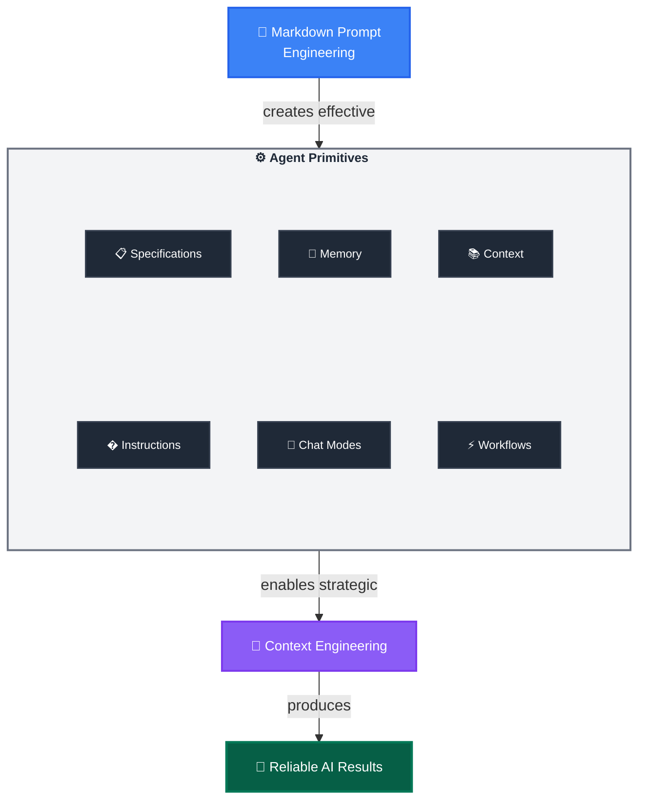

# 🎯 GitHub Copilot Mastery: AI Native Development Guide

*Maximize results with [GitHub Copilot](https://docs.github.com/en/copilot) and Coding Agents through systematic [Agent Primitives](https://code.visualstudio.com/docs/copilot/copilot-customization) and Prompt Engineering in Markdown*

> 🌟 **Community Resources:** Explore the [Awesome GitHub Copilot](https://github.com/github/awesome-copilot) repository for hundreds of community-contributed instructions, prompts, and chat modes across all major languages and frameworks. This catalog provides ready-to-use primitives that demonstrate advanced customization patterns and best practices.

## 🧠 CORE CONCEPTS: The Engineering Behind Agent Mastery

### Layer 1: Markdown Prompt Engineering
**The Foundation:** Transform natural language into structured, repeatable instructions using Markdown's semantic power.

**Why This Works:** Markdown's structure (headers, lists, links) naturally guides AI reasoning, making outputs more predictable and consistent.

**Key Techniques:**
- **Context Loading**: `[Review existing patterns](./src/patterns/)` - Links become context injection points that pull in relevant information, either from files or websites
- **Structured Thinking**: Headers and bullets create clear reasoning pathways for the AI to follow
- **Role Activation**: "You are an expert [role]" - Triggers specialized knowledge domains and focuses responses
- **Tool Integration**: *Use MCP tool `tool-name`* - Connects to deterministic code execution from MCP servers
- **Precision Language**: Eliminate ambiguity through specific, unambiguous instructions
- **Validation Gates**: "Stop and get user approval" - Human oversight at critical decision points

**Quick Win Example:**
```markdown
Instead of: "Fix the bug"
Use: "Review the error logs in `./logs/error.log` and identify the root cause. 
List 3 potential solutions with trade-offs before implementing any changes."
```

### Layer 2: Agent Primitives  
**The Implementation:** The configurable tools that systematically deploy your prompt engineering techniques.

**Core Primitives:**
- **Instructions Files**: Deploy structured guidance through `.instructions.md` files with targeted scope
- **Chat Modes**: Deploy role-based expertise through `.chatmode.md` files for domain-specific interactions
- **Prompt Workflows**: Deploy reusable task templates through `.prompt.md` files with built-in validation
- **Specification Files**: Create implementation-ready blueprints through `.spec.md` files that ensure deterministic outcomes across human and AI executors
- **Agent Memory Files**: Preserve knowledge across sessions through `.memory.md` files
- **Context Helper Files**: Optimize information retrieval through `.context.md` files

**The Transformation Effect:** Agent Primitives convert prompt techniques into systematic, self-improving outcomes.

**Example Transformation:**
- **Technique**: "Implement secure user authentication system" (Markdown Prompt Engineering)
- **Primitives**: Developer selects `@backend-dev` mode → Auto-triggers `security.instructions.md` via `applyTo: "auth/**"` → Loads context from `[Previous auth patterns](.memory.md#security)` and `[API standards](.context.md#rest)` → Generates `user-auth.spec.md` using structured templates → Executes `implement-from-spec.prompt.md` workflow with validation gates (Agent Primitives)
- **Outcome**: Self-evolving intelligence where implementation failures update `.memory.md`, successful patterns enhance `.instructions.md`, and refined workflows improve `.prompt.md` files—creating compound knowledge that gets better over time (Context Engineering)

### Layer 3: Context Engineering
**The Strategic Framework:** Systematic management of LLM context windows to maximize cognitive performance within memory constraints.

**Why Context Matters:** LLMs have finite attention spans. Strategic context management ensures they focus on what's most relevant to your current task.

**Key Techniques:**
- **Session Splitting**: Use distinct Agent sessions for different development phases (planning → implementation → testing). Fresh context = better focus
- **Modular Rule Loading**: Apply only relevant instructions through targeted `.instructions.md` files using `applyTo` yaml frontmatter syntax, preserving context space for actual work
- **Memory-Driven Development**: Leverage Agent Memory Files to maintain project knowledge and decisions across sessions and time
- **Context Optimization**: Use Context Helper Files strategically to accelerate information retrieval and reduce cognitive load
- **Cognitive Focus Optimization**: Use chat modes in `.chatmode.md` files to constrain AI attention to relevant domains, preventing cross-domain interference

**Practical Benefits:**
- **Session Splitting**: Fresh context window for complex tasks
- **Modular Rules**: Reduced irrelevant suggestions through targeted instructions
- **Memory-Driven Development**: Preserved project knowledge and decision history across time
- **Context Optimization**: Faster information retrieval and reduced cognitive overhead

**Implementation Through Primitives:** Each context engineering technique uses Agent Primitives strategically, creating compound benefits for cognitive performance.


### The Synergy Effect



**Markdown Prompt Engineering + Agent Primitives = Context Engineering**

## 🌟 PRIMITIVES IN ACTION: Complete Workflow

**Scenario:** Adding OAuth authentication to a Node.js API - from planning to self-improving intelligence

### Step 1: Mode Selection & Automatic Context Assembly
```markdown
Developer: "@backend-dev I need to add OAuth authentication"
```

**What Happens Behind the Scenes:**
- `backend-dev.chatmode.md` activates with security-focused tool boundaries
- Automatically triggers `security.instructions.md` via `applyTo: "auth/**"` pattern
- VSCode loads domain-specific guidance without polluting global context

### Step 2: Intelligent Context Loading via Markdown Links
**From `security.instructions.md`:**
```markdown
## Context Loading
Before implementing authentication, review:
- [Previous security decisions](./.memory.md#auth-patterns)
- [API security standards](./.context.md#security-requirements)
- [Team authentication patterns](./.context.md#oauth-implementations)

## Security Requirements
- Use industry-standard OAuth 2.0 flow
- Implement proper token validation
- <use-mcp-tool name="security-scanner">
```

**Intelligence Layer:** Links automatically pull in relevant project history and standards, creating contextually-aware responses.

### Step 3: Spec-First Planning with Template Structure
**Generated:** `features/auth/oauth-integration.spec.md`
```markdown
# Feature: OAuth 2.0 Authentication System

## Problem Statement
Users need secure third-party authentication via Google/GitHub OAuth providers.

## Approach  
Implement OAuth 2.0 authorization code flow with JWT token management.

## Implementation Requirements
### Core Components
- [ ] OAuth middleware (`src/middleware/oauth.ts`)
- [ ] Token service (`src/services/auth.ts`) 
- [ ] User profile sync (`src/services/user-sync.ts`)

### API Contracts
- `GET /auth/oauth/:provider` - Initiates OAuth flow
- `GET /auth/callback/:provider` - Handles OAuth callback
- `POST /auth/refresh` - Refreshes JWT tokens

### Context References
- Security patterns: [View previous implementations](./.memory.md#oauth-v2)
- API standards: [REST conventions](./.context.md#api-design)

### Validation Criteria
- [ ] Handles OAuth errors with proper redirects
- [ ] JWT tokens properly signed and validated
- [ ] User data synced securely on first login
- [ ] Unit tests >95% coverage
- [ ] Integration tests for all OAuth flows
```

### Step 4: Implementation via Validated Prompt Workflow
**Executed:** `.github/prompts/implement-from-spec.prompt.md`
```markdown
---
tools: ["file-search", "semantic-search", "test-runner"]
validation: required
---
# Spec-to-Implementation Workflow

## Context Loading Phase
1. Load specification: [${specFile}]
2. Review security patterns: [Security context](./.context.md#security)
3. Check similar implementations: <use-tool name="semantic-search" query="oauth authentication">

## Implementation Phase  
Generate implementation following specification requirements:
- [ ] Core component files with proper interfaces
- [ ] Comprehensive error handling and logging
- [ ] Security-first validation at all boundaries
- [ ] Complete test coverage including edge cases

## Human Validation Gate
🚨 **STOP**: Present implementation plan before code generation.
Required approvals:
- [ ] Security architecture review
- [ ] API contract validation  
- [ ] Testing strategy confirmation

## Post-Implementation Learning
After completion, update primitives based on outcomes:
- Add successful patterns to `.memory.md`
- Enhance instructions based on discovered edge cases
- Refine prompt workflow based on validation feedback
```

### Step 5: Self-Improving Intelligence Loop

**When Implementation Succeeds:**
- `.memory.md` updated: "OAuth flow with Google/GitHub providers - JWT refresh pattern worked well"
- `security.instructions.md` enhanced: "Always implement refresh token rotation for OAuth"
- `implement-from-spec.prompt.md` refined: "Add OAuth-specific validation checkpoints"

**When Implementation Fails:**
- `.memory.md` records: "OAuth PKCE flow required for mobile clients - add to future specs"
- `security.instructions.md` updated: "Validate OAuth provider configuration before implementation"
- Specification template enhanced with mobile OAuth considerations

### The Compound Intelligence Effect

**Traditional Approach:** Each OAuth implementation starts from scratch, same mistakes repeated.

**AI Native Approach:** Each OAuth implementation makes the system smarter:
- **Memory**: Preserves successful patterns and failure lessons
- **Instructions**: Auto-improve based on real project outcomes  
- **Workflows**: Refine validation gates based on discovered edge cases
- **Context**: Accumulate domain expertise across projects

**Result:** The 10th OAuth implementation is dramatically better than the 1st, with the intelligence built into the primitives themselves, not just the developer's memory.

---

## I. FOUNDATION SETUP (Agent Primitives)

### A. Instructions Architecture
**✅ Quick Actions:**
- Create the general [`copilot-instructions.md`](https://code.visualstudio.com/docs/copilot/copilot-customization#_use-a-githubcopilot-instructionsmd-file) file for the repository with common rules
- Create modular [`.instructions.md` files](https://code.visualstudio.com/docs/copilot/copilot-customization#_use-instructionsmd-files) by domain (frontend, backend, testing, docs, specs...)
- Use [`applyTo: "**/*.{js,ts...}"`](https://code.visualstudio.com/docs/copilot/copilot-customization#_instructions-file-structure) patterns for selective application
- Store workspace instructions in `.github/instructions/`

> 💡 **Context Engineering in Action**: Modular instructions preserve context space by loading only relevant guidelines when working on specific file types, leaving maximum buffer for code understanding.

**🔧 Tools & Files:**
```
.github/
├── copilot-instructions.md          # Global workspace rules
└── instructions/
    ├── frontend.instructions.md     # applyTo: "**/*.{jsx,tsx,css}"
    ├── backend.instructions.md      # applyTo: "**/*.{py,go,java}"
    └── testing.instructions.md      # applyTo: "**/test/**"
```

**Example: Markdown Prompt Engineering in Instructions**
```markdown
---
applyTo: "**/*.{ts,tsx}"
---
# TypeScript Development Guidelines

## Context Loading
Review [project conventions](../docs/conventions.md) and 
[type definitions](../types/index.ts) before starting.

## Deterministic Requirements
- Use strict TypeScript configuration
- Implement error boundaries for React components
- <use-linter tool="eslint-typescript">

## Structured Output
Generate code with:
- [ ] JSDoc comments for all public APIs
- [ ] Unit tests in `__tests__/` directory
- [ ] Type exports in appropriate index files
```

**⚠️ Checkpoint:** Instructions are context-efficient and non-conflicting

### B. Chat Modes Configuration
**✅ Quick Actions:**
- Define domain-specific [custom chat modes](https://code.visualstudio.com/docs/copilot/copilot-customization#_custom-chat-modes) with tool boundaries
- Encapsulate tech stack knowledge and guidelines per mode
- Configure [MCP tools](https://docs.github.com/en/copilot/how-tos/agents/coding-agent/extending-copilot-coding-agent-with-the-model-context-protocol-mcp) availability by domain

**🔧 Tools & Files:**
```
.github/
└── chatmodes/
    ├── spec-writer.chatmode.md           # Planning only, no file edits, documentation tools
    ├── frontend-dev.chatmode.md          # React/Vue tools, styling utilities, component libraries
    ├── backend-dev.chatmode.md           # Database tools, API testing, deployment utilities
    └── docs-writer.chatmode.md           # Markdown tools, diagram generation, documentation sync
```

**⚠️ Checkpoint:** Each mode has clear boundaries and tool restrictions

### C. Reusable Prompt Library
**✅ Quick Actions:**
- Create [`.prompt.md` files](https://code.visualstudio.com/docs/copilot/copilot-customization#_prompt-files-experimental) for recurring tasks
- Build in mandatory human validation points
- Design for multi-task delegation patterns

> 💡 **Markdown Prompt Engineering**: Prompt files are context-efficient templates that combine semantic structure, tool delegation, and validation checkpoints for statistical repeatability.

**🔧 Tools & Files:**
```
.github/prompts/
├── code-review.prompt.md           # With validation checkpoints
├── feature-spec.prompt.md          # Spec-first methodology
└── async-implementation.prompt.md  # GitHub Coding Agent delegation
```

**Example: Advanced Prompt Engineering Pattern**
```markdown
---
mode: agent
model: gpt-4
tools: ["file-search", "semantic-search", "github"]
---
# Feature Implementation from Specification

## Context Loading Phase
1. Review [project specification](${specFile})
2. Analyze [existing codebase patterns](./src/patterns/)
3. Check [API documentation](./docs/api.md)

## Deterministic Execution
<use-tool name="semantic-search" query="similar implementations">
<use-tool name="file-search" pattern="**/*.test.{js,ts}">

## Structured Output Requirements
Create implementation with:
- [ ] Feature code in appropriate module
- [ ] Comprehensive unit tests (>90% coverage)
- [ ] Integration tests for API endpoints
- [ ] Documentation updates

## Human Validation Gate
🚨 **STOP**: Review implementation plan before proceeding to code generation.
Confirm: Architecture alignment, test strategy, and breaking change impact.
```

**⚠️ Checkpoint:** Prompts include explicit validation gates

### D. Specification Templates
**✅ Quick Actions:**
- Create standardized [`.spec.md` templates](https://docs.github.com/en/copilot/copilot-chat/copilot-chat-cookbook) for feature specifications
- Build implementation-ready blueprints with validation criteria
- Design for deterministic handoff between planning and execution phases

> 💡 **Bridge Primitive**: Specification files transform planning-phase thinking into implementation-ready artifacts that work reliably across different executors (human or AI).

**🔧 Tools & Files:**
```
.github/specs/
├── feature-template.spec.md        # Standard feature specification template
├── api-endpoint.spec.md           # API-specific specification template
└── component.spec.md              # UI component specification template
```

**Example: Implementation-Ready Specification**
```markdown
# Feature: User Authentication System

## Problem Statement
Users need secure access to the application with JWT-based authentication.

## Approach
Implement middleware-based authentication with token validation and refresh capabilities.

## Implementation Requirements
### Core Components
- [ ] JWT middleware (`src/middleware/auth.ts`)
- [ ] Token service (`src/services/token.ts`)
- [ ] User validation (`src/services/user.ts`)

### API Contracts
- `POST /auth/login` - Returns JWT token
- `POST /auth/refresh` - Refreshes expired token
- `GET /auth/verify` - Validates current token

### Validation Criteria
- [ ] Handles malformed tokens with 401 status
- [ ] Token expiration properly managed
- [ ] Refresh token rotation implemented
- [ ] Unit tests >90% coverage
- [ ] Integration tests for all endpoints

## Handoff Checklist
- [ ] Architecture approved by team lead
- [ ] Database schema finalized
- [ ] Security review completed
- [ ] Implementation ready for assignment
```

**⚠️ Checkpoint:** Specifications are implementation-ready before delegation

## II. SPEC-DRIVEN WORKFLOW (Planning Phase)

### A. Spec-First Methodology
**✅ Quick Actions:**
1. **Lock Down Approach:** "Show me your approach and spec - do not edit any files yet"
2. **Iterate on Alignment:** Multiple rounds of spec refinement before implementation
3. **Scope Delimitation:** Precise boundaries to avoid cognitive load and context overflow
4. **Outcome Oriented:** Define outcomes to ensure the agent knows the definition of done

**🔧 Tools & Files:**
- Use `.spec.md` files for locked specifications
- Template: Problem → Approach → Implementation Plan → Validation Criteria

**⚠️ Checkpoint:** Spec is approved before any code changes
**📊 Success Metric:** Spec outcomes achieved, Zero scope creep during implementation

### B. Context Management
**✅ Quick Actions:**
- **Session Splitting:** Separate planning and implementation in different Agent sessions
- **SDLC Phase Separation:** Spec → Implement → Test → Deploy in different sessions
- **Context Buffer Optimization:** Start each phase with full context memory

> 💡 **Context Engineering Mastery**: Strategic session boundaries act as cognitive "clean slates," allowing agents to dedicate 100% of context window to each development phase without interference from previous phases.

**🔧 Tools & Files:**
- Session 1: Requirements → `.spec.md` (planning mode)
- Session 2: `.spec.md` → Implementation (development mode)
- Session 3: Testing & Deployment (ops mode)

**Example: Context-Optimized Session Handoff**
```markdown
## Session 1 Output: specification.md
### Implementation Ready Checklist
- [x] Architecture decisions documented
- [x] API contracts defined
- [x] Database schema finalized
- [x] Testing strategy outlined

### Session 2 Context Primer
Agent will implement features based on this specification:
[Link to complete spec](./specification.md)

Key constraints:
- Database: PostgreSQL with Prisma ORM
- API: REST with OpenAPI documentation
- Testing: Jest + Supertest integration tests
```

**⚠️ Checkpoint:** Each session starts with clear context boundaries
**📊 Success Metric:** Agent maintains full context awareness per phase

## III. EXECUTION STRATEGY (Implementation Phase)

### A. Determinism Control
**✅ Quick Actions:**
- **High Determinism:** Detailed step-by-step instructions, smaller scope
- **Medium Determinism:** Clear guidelines with some flexibility
- **Low Determinism:** High-level objectives, larger scope

> 💡 **Semantic Precision Principle**: The more specific and unambiguous your Markdown prompts, the higher the statistical likelihood of reproducible outcomes across multiple agent interactions.

**🔧 Tools & Files:**
```
Determinism Scale:
├── Critical Systems: Detailed prompts, single-file scope
├── Standard Features: Structured prompts, module scope  
└── Exploratory Tasks: High-level prompts, component scope
```

**Example: High-Determinism Markdown Pattern**
```markdown
## Task: Implement JWT Authentication Middleware

### Exact Requirements
1. Create file: `src/middleware/auth.ts`
2. Export function: `authenticateJWT(req, res, next)`
3. Use library: `jsonwebtoken@9.0.0`
4. Secret from: `process.env.JWT_SECRET`

### Deterministic Implementation Steps
```typescript
// Step 1: Import dependencies (exact syntax)
import jwt from 'jsonwebtoken';
import { Request, Response, NextFunction } from 'express';

// Step 2: Interface definition (mandatory)
interface AuthenticatedRequest extends Request {
  user?: { id: string; email: string };
}
```

### Validation Criteria
- [ ] Handles malformed tokens with 401 status
- [ ] Sets req.user on successful verification
- [ ] Includes comprehensive error logging

**⚠️ Checkpoint:** Determinism level matches task criticality
**📊 Success Metric:** Predictable outcomes aligned with requirements

### B. Asynchronous Delegation
**✅ Quick Actions:**
1. **Spec Handoff:** Complete `.spec.md` files ready for delegation
2. **[GitHub Coding Agent](https://docs.github.com/en/copilot/about-github-copilot/about-copilot-coding-agent):** Create issues from specs for async implementation
3. **VSCode Follow-up:** Monitor and iterate on agent work from VSCode

**🔧 Tools & Files:**
- Spec template includes implementation checklist
- GitHub issue templates link to spec files
- VSCode tasks for monitoring agent progress

**⚠️ Checkpoint:** Specs are implementation-ready before delegation
**📊 Success Metric:** Async tasks complete without clarification rounds

## IV. SCALE & GOVERNANCE (Team Adoption)

### A. Human Validation Gates
**✅ Quick Actions:**
- **Architecture Decisions:** Manual approval before major changes
- **Security Reviews:** Human validation for security-critical code
- **Deployment Gates:** Manual verification before production releases

**🔧 Tools & Files:**
- Validation prompts: "Summarize changes and wait for approval"
- Review checklists embedded in prompt files
- Automated pause points in workflows

### B. Multi-task Orchestration
**✅ Quick Actions:**
- **Parallel Delegation:** Multiple [GitHub Coding Agents](https://docs.github.com/en/copilot/how-tos/agents/coding-agent/enabling-copilot-coding-agent) on different components
- **Dependency Management:** Clear task sequencing and handoff points
- **Progress Tracking:** Centralized view of distributed agent work

**🔧 Tools & Files:**
- Master task breakdown with dependency graphs
- Standardized progress reporting from agents
- Integration testing between agent-delivered components

### C. Knowledge Sharing Patterns
**✅ Quick Actions:**
- **Team Instructions:** Shared `.instructions.md` files in repositories
- **Prompt Libraries:** Reusable prompts across team members
- **Best Practices:** Documented patterns and anti-patterns

**🔧 Tools & Files:**
- Team-wide instruction files in shared repositories
- Prompt file versioning and change management
- Regular retrospectives on agent effectiveness

---

## 🚀 Quick Start Checklist

### Conceptual Foundation
1. **[ ]** Understand **Markdown Prompt Engineering** principles (semantic structure + precision + tools)
2. **[ ]** Grasp **Context Engineering** fundamentals (buffer optimization + session strategy)

### Implementation Steps
3. **[ ]** Create [`.github/copilot-instructions.md`](https://code.visualstudio.com/docs/copilot/copilot-customization#_use-a-githubcopilot-instructionsmd-file) with basic project guidelines (Context Engineering: global rules)
4. **[ ]** Set up domain-specific [`.instructions.md` files](https://code.visualstudio.com/docs/copilot/copilot-customization#_use-instructionsmd-files) with `applyTo` patterns (Context Engineering: selective loading)
5. **[ ]** Configure [chat modes](https://code.visualstudio.com/docs/copilot/copilot-customization#_custom-chat-modes) for your tech stack domains (Context Engineering: domain boundaries)
6. **[ ]** Create first [`.prompt.md` file](https://code.visualstudio.com/docs/copilot/copilot-customization#_prompt-files-experimental) with validation checkpoints (Markdown Prompt Engineering: deterministic templates)
7. **[ ]** Build your first `.spec.md` template for feature specifications (Agent Primitive: deterministic planning-to-implementation bridge)
8. **[ ]** Practice spec-first workflow: plan first, implement second (Context Engineering: session splitting)
9. **[ ]** Test async delegation with [GitHub Coding Agent](https://docs.github.com/en/copilot/about-github-copilot/about-copilot-coding-agent) (Advanced orchestration)
10. **[ ]** Establish team governance and validation gates (Human-AI collaboration patterns)

## 📈 Mastery Progression

**Foundation** → Understand core concepts  
**Beginner** → Basic instructions and prompts  
**Intermediate** → Spec-driven workflows with context optimization  
**Advanced** → Async delegation and multi-agent orchestration  
**Expert** → Team-wide governance and frontier pattern innovation

---

## 🎯 The Paradigm Shift

*Traditional approach: "Tell the AI what to do"*  
**Agent Mastery approach: "Engineer the context and structure for optimal cognitive performance"**

**Remember:** The more determinism you need, the more **Markdown Prompt Engineering** and smaller scope you must use. The more complex your project, the more **Context Engineering** becomes critical. Master both, and you'll achieve unprecedented consistency and quality in agent-driven development.

**Start simple, iterate fast, scale systematically through systematic application of these frontier concepts.**

## 📚 Documentation References

### Community Resources
- **[Awesome GitHub Copilot](https://github.com/github/awesome-copilot)** - Comprehensive catalog of community-contributed instructions, prompts, and chat modes across all major languages and frameworks

### VSCode Copilot Customization
- **[Main Customization Guide](https://code.visualstudio.com/docs/copilot/copilot-customization)** - Complete overview of VSCode Copilot primitives
- **[Custom Instructions (.github/copilot-instructions.md)](https://code.visualstudio.com/docs/copilot/copilot-customization#_use-a-githubcopilot-instructionsmd-file)** - Global workspace instructions
- **[Modular Instructions (.instructions.md)](https://code.visualstudio.com/docs/copilot/copilot-customization#_use-instructionsmd-files)** - Domain-specific instructions with applyTo patterns
- **[Prompt Files (.prompt.md)](https://code.visualstudio.com/docs/copilot/copilot-customization#_prompt-files-experimental)** - Reusable task-specific prompts
- **[Custom Chat Modes](https://code.visualstudio.com/docs/copilot/copilot-customization#_custom-chat-modes)** - Configure domain-specific chat behavior

### GitHub Copilot Documentation
- **[GitHub Copilot Overview](https://docs.github.com/en/copilot)** - Complete GitHub Copilot documentation
- **[GitHub Coding Agent](https://docs.github.com/en/copilot/about-github-copilot/about-copilot-coding-agent)** - Async agent for issue assignment and PR creation
- **[Enabling Coding Agent](https://docs.github.com/en/copilot/how-tos/agents/coding-agent/enabling-copilot-coding-agent)** - Setup and configuration
- **[MCP Integration](https://docs.github.com/en/copilot/how-tos/agents/coding-agent/extending-copilot-coding-agent-with-the-model-context-protocol-mcp)** - Extend agent capabilities
- **[Copilot Chat Best Practices](https://docs.github.com/en/copilot/copilot-chat/copilot-chat-cookbook)** - Effective prompting examples
- **[Responsible Use Guidelines](https://docs.github.com/en/copilot/responsible-use-of-github-copilot-features/responsible-use-of-copilot-coding-agent-on-githubcom)** - Best practices for coding agent usage
