# 🎯 GitHub Copilot Mastery: AI Native Development Guide

*Maximize results with [GitHub Copilot](https://docs.github.com/en/copilot) and Coding Agents through systematic [Agent Primitives](https://code.visualstudio.com/docs/copilot/copilot-customization) and Prompt Engineering in Markdown*

> 🌟 **Community Resources:** Explore the [Awesome GitHub Copilot](https://github.com/github/awesome-copilot) repository for hundreds of community-contributed instructions, prompts, and chat modes across all major languages and frameworks. This catalog provides ready-to-use primitives that demonstrate advanced customization patterns and best practices.

## ⚡ Quick Start: What This Guide Delivers

**For Busy Developers** (2-minute read):
- **Immediate Win**: Turn unreliable AI chats into consistent, professional workflows
- **Core Technique**: Use structured Markdown to guide AI reasoning (like coding standards for prompts)
- **Scale Up**: Build reusable AI configurations that improve over time
- **Team Benefit**: Share successful AI patterns across your organization

**Three Learning Paths:**
- 🚀 **Quick Wins** → Jump to [Foundation Setup](#i-foundation-setup-agent-primitives) for immediate improvements
- 🧠 **Deep Understanding** → Start with [Core Concepts](#-core-concepts-the-engineering-behind-agent-mastery) for theoretical foundation  
- 👥 **Team Implementation** → Begin with [Team Adoption](#iii-team-adoption--governance) for organizational strategy

### Before We Dive Deep: Core Mental Model

Think of AI Native Development like **professional software development practices**:
- **Markdown Prompt Engineering** = Coding standards for AI interactions
- **Agent Primitives** = Reusable libraries and configurations  
- **Context Engineering** = Memory and performance optimization

*If this resonates, continue reading. If you prefer hands-on learning, jump to the [Quick Start Checklist](#-quick-start-checklist).*

## 📖 Table of Contents

### 🧠 [Core Concepts](#-core-concepts-the-engineering-behind-agent-mastery)
- [Layer 1: Markdown Prompt Engineering](#layer-1-markdown-prompt-engineering)
- [Layer 2: Agent Primitives](#layer-2-agent-primitives)
- [Layer 3: Context Engineering](#layer-3-context-engineering)
- [The AI Native Development Framework](#the-ai-native-development-framework)

### 🌟 [Primitives in Action](#-primitives-in-action-complete-workflow)
- [Step 1: Mode Selection & Automatic Context Assembly](#step-1-mode-selection--automatic-context-assembly)
- [Step 2: Intelligent Context Loading via Markdown Links](#step-2-intelligent-context-loading-via-markdown-links)
- [Step 3: Spec-First Planning with Template Structure](#step-3-spec-first-planning-with-template-structure)
- [Step 4: Implementation via Validated Prompt Workflow](#step-4-implementation-via-validated-prompt-workflow)
- [Step 5: Developer-Driven Intelligence Refinement](#step-5-developer-driven-intelligence-refinement)
- [The Compound Intelligence Effect](#the-compound-intelligence-effect)

### 🏗️ [I. Foundation Setup (Agent Primitives)](#i-foundation-setup-agent-primitives)
- [A. Instructions Architecture](#a-instructions-architecture)
- [B. Chat Modes Configuration](#b-chat-modes-configuration)
- [C. Reusable Prompt Library](#c-reusable-prompt-library)
- [D. Specification Templates](#d-specification-templates)

### ⚙️ [II. Workflow Orchestration](#ii-workflow-orchestration-planning-to-execution-bridge)
- [A. Execution Path Selection](#a-execution-path-selection)
- [B. Async Delegation Workflows](#b-async-delegation-workflows)
  - [B.1. Single Agent Delegation](#b1-single-agent-delegation)
  - [B.2. Parallel Multi-Agent Delegation](#b2-parallel-multi-agent-delegation-spec-to-issues-pattern)
- [C. Progress Monitoring & Async Integration](#c-progress-monitoring--async-integration)
  - [C.1. Multi-Channel Progress Tracking](#c1-multi-channel-progress-tracking)
  - [C.2. Async Agent Quality Gates](#c2-async-agent-quality-gates)
- [D. Advanced: Hybrid Context Strategies](#d-advanced-hybrid-context-strategies)

### 👥 [III. Team Adoption & Governance](#iii-team-adoption--governance)
- [A. Human Validation Gates & Review Processes](#a-human-validation-gates--review-processes)
- [B. Multi-Agent Orchestration & Dependency Management](#b-multi-agent-orchestration--dependency-management)
- [C. Knowledge Sharing & Team Intelligence Patterns](#c-knowledge-sharing--team-intelligence-patterns)
- [D. Governance & Compliance Framework](#d-governance--compliance-framework)

### 🚀 [Quick Start Checklist](#-quick-start-checklist)
### 📈 [Mastery Progression](#-mastery-progression)
### 🎯 [The Paradigm Shift](#-the-paradigm-shift)
### 📚 [Documentation References](#-documentation-references)

---

## 🧠 CORE CONCEPTS: The Engineering Behind Agent Mastery

### Layer 1: Markdown Prompt Engineering
**The Foundation:** Transform natural language into structured, repeatable instructions using Markdown's semantic power.

**Why This Works:** Markdown's structure (headers, lists, links) naturally guides AI reasoning, making outputs more predictable and consistent.

**Key Techniques:**
- **Context Loading**: `[Review existing patterns](./src/patterns/)` - Links become context injection points that pull in relevant information, either from files or websites
- **Structured Thinking**: Headers and bullets create clear reasoning pathways for the AI to follow
- **Role Activation**: "You are an expert [role]" - Triggers specialized knowledge domains and focuses responses
- **Tool Integration**: *Use MCP tool `tool-name`* - Connects to deterministic code execution from MCP servers
- **Precision Language**: Eliminate ambiguity through specific, unambiguous instructions
- **Validation Gates**: "Stop and get user approval" - Human oversight at critical decision points

**Quick Win Example:**

Instead of: `Find and fix the bug`, use:

```markdown
You are an expert debugger, specialized in debugging complex programming issues. 

You are particularly great at debugging this project, which architecture and quirks can be consulted in the [architecture document](./docs/architecture.md). 

Follow these steps:

1. Review the [error logs](./logs/error.log) and identify the root cause. 

2. Use the `azmcp-monitor-log-query` MCP tool to retrieve infrastructure logs from Azure.  

3. Once you find the root cause, think about 3 potential solutions with trade-offs

4. Present your root cause analysis and suggested solutions with trade-offs to the user and seek validation before proceeding with fixes - do not change any files.
```

### Layer 2: Agent Primitives  
**The Implementation:** The configurable tools that systematically deploy your prompt engineering techniques.

**Core Primitives:**
- **Instructions Files**: Deploy structured guidance through modular `.instructions.md` files with targeted scope
- **Chat Modes**: Deploy role-based expertise through `.chatmode.md` files with MCP tool boundaries that prevent security breaches and cross-domain interference - like professional licenses that keep architects from building and engineers from planning
- **Prompt Workflows**: Deploy reusable task templates through `.prompt.md` files with built-in validation
- **Specification Files**: Create implementation-ready blueprints through `.spec.md` files that ensure deterministic outcomes across human and AI executors
- **Agent Memory Files**: Preserve knowledge across sessions through `.memory.md` files
- **Context Helper Files**: Optimize information retrieval through `.context.md` files

**The Transformation Effect:** Agent Primitives are the core configurable elements that AI Native Developers iteratively refine to ensure reliable outcomes through systematic prompt engineering.

**Example Transformation:**
- **Technique**: "Implement secure user authentication system" (Markdown Prompt Engineering)
- **Primitives**: Developer selects `backend-dev` chat mode → Auto-triggers `security.instructions.md` via `applyTo: "auth/**"` → Loads context from `[Previous auth patterns](.memory.md#security)` and `[API Security Standards](api-security.context.md#rest)` → Generates `user-auth.spec.md` using structured templates → Executes `implement-from-spec.prompt.md` workflow with validation gates (Agent Primitives)
- **Outcome**: Developer-driven knowledge accumulation where you capture implementation failures in `.memory.md`, document successful patterns in `.instructions.md`, and refine workflows in `.prompt.md` files—creating compound intelligence that improves through your iterative refinement (Context Engineering)

> 💡 **Native VSCode Support**: While VSCode natively supports `.instructions.md`, `.prompt.md`, and `.chatmode.md` files, this framework extends the paradigm with `.spec.md`, `.memory.md`, and `.context.md` patterns that represent frontier concepts in AI Native Development.

### Layer 3: Context Engineering
**The Strategic Framework:** Systematic management of LLM context windows to maximize agent performance within memory constraints.

**Why Context Matters:** LLMs have finite attention spans, limited memory (context windows) and are forgetful. Strategic context management not only helps agents focus on relevant information, but enables them to get started quicker by reducing the need to search for and ingest irrelevant or confusing information—thus preserving valuable context window space and improving reliability and effectiveness.

**Key Techniques:**
- **Session Splitting**: Use distinct Agent sessions for different development phases (planning → implementation → testing). Fresh context = better focus
- **Modular Rule Loading**: Apply only relevant instructions through targeted `.instructions.md` files using `applyTo` yaml frontmatter syntax, preserving context space for actual work
- **Memory-Driven Development**: Leverage Agent Memory through `.memory.md` files to maintain project knowledge and decisions across sessions and time
- **Context Optimization**: Use `.context.md` Context Helper Files strategically to accelerate information retrieval and reduce cognitive load
- **Cognitive Focus Optimization**: Use chat modes in `.chatmode.md` files to constrain AI attention to relevant domains, preventing cross-domain interference

**Practical Benefits:**
- **Session Splitting**: Fresh context window for complex tasks
- **Modular Rules**: Reduced irrelevant suggestions through targeted instructions
- **Memory-Driven Development**: Preserved project knowledge and decision history across time
- **Context Optimization**: Faster startup time and reduced cognitive overhead through pre-curated information
- **Reliability Boost**: Less context pollution leads to more consistent and accurate outputs

**Implementation Through Primitives:** Each context engineering technique uses Agent Primitives strategically, creating compound benefits for cognitive performance.


### The AI Native Development Framework

```mermaid
flowchart TD
    A["🔧 Markdown Prompt<br/>Engineering"] 
    
    subgraph B ["⚙️ Agent Primitives"]
        subgraph B_ROW1 [" "]
            B1["� Instructions"]
            B2["💬 Chat Modes"] 
            B3["⚡ Workflows"]
        end
        subgraph B_ROW2 [" "]
            B4["📋 Specifications"]
            B5["🧠 Memory"]
            B6["📚 Context"]
        end
    end
    
    C["🎯 Context Engineering"]
    D["🚀 Reliable AI Results"]
    
    A -->|"creates effective"| B
    B -->|"enables strategic"| C
    C -->|"produces"| D
    
    %% Elegant, accessible color palette with proper contrast
    classDef foundation fill:#3b82f6,stroke:#2563eb,stroke-width:2px,color:#ffffff,font-size:14px
    classDef primitives fill:#1f2937,stroke:#374151,stroke-width:1.5px,color:#ffffff,font-size:12px
    classDef optimization fill:#8b5cf6,stroke:#7c3aed,stroke-width:2px,color:#ffffff,font-size:14px
    classDef outcome fill:#065f46,stroke:#047857,stroke-width:2.5px,color:#ffffff,font-size:14px
    
    class A foundation
    class B1,B2,B3,B4,B5,B6 primitives
    class C optimization
    class D outcome
    
    %% Hide the row subgraph borders
    style B_ROW1 fill:transparent,stroke:none
    style B_ROW2 fill:transparent,stroke:none
    
    %% High contrast container styling for Agent Primitives with spacing
    style B fill:#f3f4f6,stroke:#6b7280,stroke-width:2px,color:#1f2937,font-size:13px,font-weight:bold,margin-top:10px,padding-top:15px
```



**Markdown Prompt Engineering + Agent Primitives = Context Engineering**

## 🌟 PRIMITIVES IN ACTION: Complete Workflow

**Scenario:** Adding OAuth authentication to a Node.js API - from planning to developer-refined intelligence

### Step 1: Mode Selection & Automatic Context Assembly
```markdown
Developer: "@backend-dev I need to add OAuth authentication"
```

> **Note:** Currently, VSCode chat mode switching requires using the Command Palette (`Cmd/Ctrl+Shift+P` → "Chat: Switch Chat Mode"), keyboard shortcuts, or the chat view dropdown. The `@backend-dev` syntax represents ideal UX that we would like to find in future versions.

**What Happens Behind the Scenes:**
- `backend-dev.chatmode.md` activates with security-focused MCP tool boundaries
- Automatically triggers `security.instructions.md` via `applyTo: "auth/**"` pattern
- VSCode loads domain-specific guidance without polluting global context

### Step 2: Intelligent Context Loading via Markdown Links
**From `security.instructions.md`:**
```markdown
---
applyTo: "./auth/**"
---

## Context Loading
Before implementing authentication, review:
- [Previous security decisions](./auth.memory.md#auth-patterns)
- [API security standards](./api-sec.context.md#security-requirements)
- [Team authentication patterns](./team-auth.context.md#oauth-implementations)

## Security Requirements
- Use industry-standard OAuth 2.0 flow
- Implement proper token validation
- Use the MCP tool `security-scanner` to ensure your implementation is secure
```

**Intelligence Layer:** Markdown hyperlinks automatically pull in relevant project history and standards, creating contextually-aware responses.

### Step 3: Spec-First Planning with Template Structure
**Generated:** `features/auth/oauth-integration.spec.md`
```markdown
# Feature: OAuth 2.0 Authentication System

## Problem Statement
Users need secure third-party authentication via Google/GitHub OAuth providers.

## Approach  
Implement OAuth 2.0 authorization code flow with JWT token management.

## Implementation Requirements
### Core Components
- [ ] OAuth middleware (`src/middleware/oauth.ts`)
- [ ] Token service (`src/services/auth.ts`) 
- [ ] User profile sync (`src/services/user-sync.ts`)

### API Contracts
- `GET /auth/oauth/:provider` - Initiates OAuth flow
- `GET /auth/callback/:provider` - Handles OAuth callback
- `POST /auth/refresh` - Refreshes JWT tokens

### Context References
- Security patterns: [View previous implementations](./auth.memory.md#oauth-v2)
- API standards: [REST conventions](./api-sec.context.md#api-design)

### Validation Criteria
- [ ] Handles OAuth errors with proper redirects
- [ ] JWT tokens properly signed and validated
- [ ] User data synced securely on first login
- [ ] Unit tests >95% coverage
- [ ] Integration tests for all OAuth flows
```

### Step 4: Implementation via Validated Prompt Workflow
**Executed:** `.github/prompts/implement-from-spec.prompt.md`
```markdown
---
mode: agent
tools: ['file-search', 'semantic-search', 'test-runner']
description: 'Spec-to-implementation workflow with validation gates'
---
# Spec-to-Implementation Workflow

## Context Loading Phase
1. Load specification: [${input:specFile}]
2. Review API security patterns: [Security context](./api-sec.context.md#security)
3. Check similar implementations using [the authentication pattern memory](./auth.memory.md#oauth-v2)

## Implementation Phase  
Generate implementation following specification requirements:
- [ ] Core component files with proper interfaces
- [ ] Comprehensive error handling and logging
- [ ] Security-first validation at all boundaries
- [ ] Complete test coverage including edge cases

## Human Validation Gate
🚨 **STOP**: Present specific implementation plan with short code snippets before code generation.
Required approvals you must get from the user:
- [ ] Security architecture review
- [ ] API contract validation  
- [ ] Testing strategy confirmation

## Post-Implementation Learning
After completion, update your primitives based on outcomes:
- Propose to add successful patterns to [auth.memory.md](./auth.memory.md#oauth-v2)
- Suggest security instruction enhancements to the user for [security.instructions.md](./.github/instructions/security.instructions.md) based on discovered edge cases 
```

### Step 5: Developer-Driven Intelligence Refinement

**When Implementation Succeeds:**
- You update `auth.memory.md`: "OAuth flow with Google/GitHub providers - JWT refresh pattern worked well"
- You enhance `security.instructions.md`: "Always implement refresh token rotation for OAuth"
- You refine `implement-from-spec.prompt.md`: "Implement learnings after user validates proposals"

**When Implementation Fails:**
- You record in `auth.memory.md`: "OAuth PKCE flow required for mobile clients - add to future specs"
- You update `security.instructions.md`: "Validate OAuth provider configuration before implementation"
- You enhance `implement-from-spec.prompt.md`: "You must include unit tests to check security of the implementation, with at least 80%+ coverage, and ensure they pass"

### The Compound Intelligence Effect

**Traditional Approach:** Each OAuth implementation starts from scratch, same mistakes repeated.

**AI Native Approach:** Each OAuth implementation allows you to refine the system:
- **Memory**: You preserve successful patterns and failure lessons
- **Instructions**: You enhance based on real project outcomes  
- **Workflows**: You refine validation gates based on discovered edge cases
- **Context**: You accumulate domain expertise across projects

**Result:** The 10th OAuth implementation is dramatically better than the 1st, with the intelligence you've built into the primitives, extending beyond just your memory.

---

## I. FOUNDATION SETUP (Agent Primitives)

### A. Instructions Architecture
**✅ Quick Actions:**
- Create the general [`copilot-instructions.md`](https://code.visualstudio.com/docs/copilot/copilot-customization#_use-a-githubcopilotinstructionsmd-file) file in the `.github` folder for the repository with common rules
- Create modular [`.instructions.md` files](https://code.visualstudio.com/docs/copilot/copilot-customization#_use-instructionsmd-files) in the `.github/instructions/` folder by domain (frontend, backend, testing, docs, specs...)
- Use [`applyTo: "**/*.{js,ts...}"`](https://code.visualstudio.com/docs/copilot/copilot-customization#_instructions-file-structure) patterns for selective application

> 💡 **Context Engineering in Action**: Modular instructions preserve context space by loading only relevant guidelines when working on specific file types, leaving maximum buffer for code understanding.

**🔧 Tools & Files:**
```
.github/
├── copilot-instructions.md          # Global repository rules
└── instructions/
    ├── frontend.instructions.md     # applyTo: "**/*.{jsx,tsx,css}"
    ├── backend.instructions.md      # applyTo: "**/*.{py,go,java}"
    └── testing.instructions.md      # applyTo: "**/test/**"
```

**Example: Markdown Prompt Engineering in Instructions**
```markdown
---
applyTo: "**/*.{ts,tsx}"
description: "TypeScript development guidelines with context engineering"
---
# TypeScript Development Guidelines

## Context Loading
Review [project conventions](../docs/conventions.md) and 
[type definitions](../types/index.ts) before starting.

## Deterministic Requirements
- Use strict TypeScript configuration
- Implement error boundaries for React components
- Apply ESLint TypeScript rules consistently

## Structured Output
Generate code with:
- [ ] JSDoc comments for all public APIs
- [ ] Unit tests in `__tests__/` directory
- [ ] Type exports in appropriate index files
```

**⚠️ Checkpoint:** Instructions are context-efficient and non-conflicting

### B. Chat Modes Configuration
**✅ Quick Actions:**
- Define domain-specific [custom chat modes](https://code.visualstudio.com/docs/copilot/chat/chat-modes) with MCP tool boundaries
- Encapsulate tech stack knowledge and guidelines per mode
- Define the most appropriate [LLM model](https://code.visualstudio.com/docs/copilot/chat/chat-modes#_chat-mode-file-example) for your chat mode like `Claude Sonnet 4`
- Configure secure [MCP tool access](https://code.visualstudio.com/docs/copilot/chat/chat-modes#_chat-mode-file-example) to prevent cross-domain security breaches

> 💡 **Security Through MCP Tool Boundaries**: Each chat mode receives only the specific MCP tools needed for their domain - preventing dangerous access escalation and cross-contamination. Like professional licensing, a planning mode can't execute destructive commands, and a frontend mode can't access backend databases.

**🔧 Tools & Files:**
```
.github/
└── chatmodes/
    ├── architect.chatmode.md             # Planning specialist - designs, cannot execute
    ├── frontend-engineer.chatmode.md     # UI specialist - builds interfaces, no backend access
    ├── backend-engineer.chatmode.md      # API specialist - builds services, no UI modification
    └── technical-writer.chatmode.md      # Documentation specialist - writes docs, cannot run code
```

**Example: MCP Tool Boundary Implementation**
```yaml
---
description: 'Backend development specialist with security focus'
tools: ['changes', 'codebase', 'editFiles', 'runCommands', 'runTasks', 
        'search', 'problems', 'testFailure', 'terminalLastCommand']
model: Claude Sonnet 4
---

You are a backend development specialist focused on secure API development, database design, and server-side architecture. You prioritize security-first design patterns and comprehensive testing strategies.

## Domain Expertise
- RESTful API design and implementation
- Database schema design and optimization  
- Authentication and authorization systems
- Server security and performance optimization

You master the backend of this project thanks to you having read all [the backend docs](../../docs/backend).

## Tool Boundaries
- **CAN**: Modify backend code, run server commands, execute tests
- **CANNOT**: Modify client-side assets
```

**Security & Professional Boundaries:**
- **Architect mode**: Research tools only - **cannot execute destructive commands or modify production code**
- **Frontend Engineer mode**: UI development tools only - **cannot access databases or backend services** 
- **Backend Engineer mode**: API and database tools only - **cannot modify user interfaces or frontend assets**
- **Technical Writer mode**: Documentation tools only - **cannot run code, deploy, or access sensitive systems**

*Like real-world professional licenses, each mode operates within its area of competence and cannot overstep into dangerous territory.*

**⚠️ Checkpoint:** Each mode has clear boundaries and tool restrictions

### C. Reusable Prompt Library
**✅ Quick Actions:**
- Create [`.prompt.md` files](https://code.visualstudio.com/docs/copilot/copilot-customization#_prompt-files-experimental) for recurring tasks
- Build in mandatory human validation points
- Design for multi-task delegation patterns

> 💡 **Markdown Prompt Engineering**: Prompt files are context-efficient templates that combine semantic structure, tool delegation, and validation checkpoints for statistical repeatability.

**🔧 Tools & Files:**
```
.github/prompts/
├── code-review.prompt.md           # With validation checkpoints
├── feature-spec.prompt.md          # Spec-first methodology
└── async-implementation.prompt.md  # GitHub Coding Agent delegation
```

**Example: Advanced Prompt Engineering Pattern**
```markdown
---
mode: agent
model: gpt-4
tools: ['file-search', 'semantic-search', 'github']
description: 'Feature implementation workflow with validation gates'
---
# Feature Implementation from Specification

## Context Loading Phase
1. Review [project specification](${specFile})
2. Analyze [existing codebase patterns](./src/patterns/)
3. Check [API documentation](./docs/api.md)

## Deterministic Execution
Use semantic search to find similar implementations
Use file search to locate test patterns: `**/*.test.{js,ts}`

## Structured Output Requirements
Create implementation with:
- [ ] Feature code in appropriate module
- [ ] Comprehensive unit tests (>90% coverage)
- [ ] Integration tests for API endpoints
- [ ] Documentation updates

## Human Validation Gate
🚨 **STOP**: Review implementation plan before proceeding to code generation.
Confirm: Architecture alignment, test strategy, and breaking change impact.
```

**⚠️ Checkpoint:** Prompts include explicit validation gates

### D. Specification Templates
**✅ Quick Actions:**
- Create standardized [`.spec.md` templates](https://docs.github.com/en/copilot/copilot-chat/copilot-chat-cookbook) for feature specifications
- Build implementation-ready blueprints with validation criteria
- Design for deterministic handoff between planning and execution phases

> 💡 **Bridge Primitive**: Specification files transform planning-phase thinking into implementation-ready artifacts that work reliably across different executors (human or AI).

**🔧 Tools & Files:**
```
.github/specs/
├── feature-template.spec.md        # Standard feature specification template
├── api-endpoint.spec.md           # API-specific specification template
└── component.spec.md              # UI component specification template
```

**Example: Implementation-Ready Specification**
```markdown
# Feature: User Authentication System

## Problem Statement
Users need secure access to the application with JWT-based authentication.

## Approach
Implement middleware-based authentication with token validation and refresh capabilities.

## Implementation Requirements
### Core Components
- [ ] JWT middleware (`src/middleware/auth.ts`)
- [ ] Token service (`src/services/token.ts`)
- [ ] User validation (`src/services/user.ts`)

### API Contracts
- `POST /auth/login` - Returns JWT token
- `POST /auth/refresh` - Refreshes expired token
- `GET /auth/verify` - Validates current token

### Validation Criteria
- [ ] Handles malformed tokens with 401 status
- [ ] Token expiration properly managed
- [ ] Refresh token rotation implemented
- [ ] Unit tests >90% coverage
- [ ] Integration tests for all endpoints

## Handoff Checklist
- [ ] Architecture approved by team lead
- [ ] Database schema finalized
- [ ] Security review completed
- [ ] Implementation ready for assignment
```

**⚠️ Checkpoint:** Specifications are implementation-ready before delegation

## II. WORKFLOW ORCHESTRATION (Planning to Execution Bridge)

### A. Execution Path Selection
**✅ Quick Actions:**
- **Local IDE Agent:** Maintain maximum control over implementation process
- **Async Delegation:** Maximize productivity for well-specified, low-deviation-risk tasks with the Coding Agent
- **Local IDE Monitoring:** Delegate for speed while preserving oversight and learning

> 💡 **Control vs. Productivity Framework**: Choose execution paths based on your desire for control, specification maturity, and tolerance for agent deviation. More control = local implementation. Higher productivity = async delegation to Coding Agent.

**🔧 Control-Based Decision Matrix:**
```
Control Preference → Recommended Path:
├── High Control Needed → Local IDE Agent (Learn, iterate, guide)
├── Productivity Focus → Async Delegation (Delegate & monitor)  
└── Balanced Approach → Hybrid (Delegate with active oversight)
```

**Decision Factors for Path Selection:**

**Choose LOCAL IDE AGENT when:**
- **Specification maturity**: Spec feels incomplete or exploratory
- **Learning mode**: You're discovering requirements as you build
- **Agent Primitive maturity**: Your instructions/prompts need refinement
- **Low deviation tolerance**: Agent deviation would be costly or risky
- **Iterative refinement**: Expect multiple rounds of adjustment

**Choose ASYNC DELEGATION TO CODING AGENT when:**
- **Specification maturity**: Well-defined, comprehensive spec available
- **Deviation tolerance**: Minor agent deviation is acceptable
- **Strong Agent Primitives**: Your instructions/context files are proven
- **Productivity focus**: Speed and parallel work more important than control
- **Well-known patterns**: Task follows established, successful patterns

**Choose HYBRID MONITORING when:**
- **Learning while delegating**: Want to observe agent decision-making
- **Risk management**: Need oversight for important implementations
- **Primitive refinement**: Want to improve your agent setup based on delegation outcomes
- **Knowledge capture**: Interested in documenting patterns for future use

**Example: Control-Based Path Selection**
```markdown
## Feature: OAuth Integration 
**Current State**: First time implementing OAuth in this codebase
**Recommended Path**: Local IDE Agent
- ❌ OAuth spec needs refinement (learning phase)
- ❌ Security patterns not yet established in primitives
- ❌ Low tolerance for auth-related deviation
- ✅ Want to learn OAuth nuances for this specific stack

## Feature: CRUD API Endpoints (5th similar implementation)
**Current State**: Well-established pattern, proven spec template
**Recommended Path**: Async Delegation  
- ✅ Refined CRUD spec template with validation criteria
- ✅ Strong .instructions.md files for API patterns
- ✅ High tolerance for minor implementation variations
- ✅ Proven successful pattern (4 previous implementations)

## Feature: Payment Integration (Critical, Learning Required)
**Current State**: Important feature, want to understand implementation
**Recommended Path**: Hybrid Monitoring
- ✅ Can delegate for speed (business priority)
- ❌ Low tolerance for deviation (financial operations)
- ✅ Want to learn payment patterns for future features
- ✅ Need to capture knowledge in primitives
```

**⚠️ Checkpoint:** Path selection aligns with control preferences and specification maturity
**📊 Success Metric:** Optimal balance between productivity and quality control

### B. Async Delegation Workflows

#### B.1. Single Agent Delegation
**✅ Quick Actions:**
- **VSCode Native**: Use `#copilotCodingAgent` in Ask chat mode for direct delegation. You need the GitHub Pull Requests VSCode extension installed.
- **GitHub MCP Server**: Leverage `create_issue` and `assign_copilot_to_issue` tools from any MCP host application
- **GitHub Web/Mobile**: Direct task assignment via Agents control plane

**🔧 Implementation Pattern:**
```markdown
## Workflow: Single Feature Delegation

1. **Spec Approval** → Validate `.spec.md` with human reviewer
2. **Entry Point Selection**:
   - VSCode: "#copilotCodingAgent implement the OAuth feature per specification"
   - MCP: Use `create_issue` and `assign_copilot_to_issue` tool with spec reference
   - GitHub: the human needs to create task via Agents page with spec attachment
3. **Handoff Confirmation** → Confirm with user and proceed
```

#### B.2. Parallel Multi-Agent Delegation (Spec-to-Issues Pattern)
**✅ Quick Actions:**
- **Spec Decomposition:** Break complex specifications into non-overlapping component issues
- **Issue Generation:** Use GitHub MCP Server `create_issue` tool for systematic issue creation
- **Parallel Assignment:** Delegate multiple issues to separate GitHub Coding Agents simultaneously with `assign_copilot_to_issue` GitHub MCP tool

> 💡 **Parallel Orchestration**: Large specifications can be decomposed into independent, parallel workstreams while maintaining architectural coherence through shared context references.

**🔧 Implementation Pattern:**
```markdown
## Workflow: Spec-to-Multiple-Issues Delegation

### Phase 1: Specification Decomposition
1. **Component Analysis** → Identify independent, non-overlapping components
2. **Dependency Mapping** → Define integration points and sequence constraints
3. **Context Distribution** → Ensure each component references shared architecture decisions
4. **Implementation dependencies** → Ensure issues have an implementation order based on mutual dependencies by creating sub-issue hierarchies

### Phase 2: Parallel Issue Generation
Use GitHub MCP Server tools:
- `create_issue(title: "OAuth Middleware Component", body: spec_section_1)`
- `create_issue(title: "Token Service Component", body: spec_section_2)`  
- `create_issue(title: "User Sync Service Component", body: spec_section_3)`

### Phase 3: Parallel Agent Assignment
- `assign_copilot_to_issue(issue_1)` → Agent A works on middleware
- `assign_copilot_to_issue(issue_2)` → Agent B works on token service
- `assign_copilot_to_issue(issue_3)` → Agent C works on user sync

### Phase 4: Coordinated Integration
- **Progress Monitoring** → Track all agents via GitHub Agents control plane
- **Integration Testing** → Validate component interactions
- **Conflict Resolution** → Address any overlapping changes
```

**Example: OAuth System Decomposition**
```markdown
# Parent Spec: OAuth 2.0 Authentication System

## Component Breakdown for Parallel Delegation:

### Issue 1: OAuth Middleware (`oauth-middleware`)
**Scope:** Request interception, provider routing, error handling
**Dependencies:** None (independent component)
**Agent Focus:** Middleware patterns, HTTP handling

### Issue 2: Token Service (`token-service`)  
**Scope:** JWT generation, validation, refresh logic
**Dependencies:** None (independent component)
**Agent Focus:** Cryptographic operations, token lifecycle

### Issue 3: User Profile Sync (`user-sync-service`)
**Scope:** OAuth callback handling, user data synchronization
**Dependencies:** Token Service (for user identification)
**Agent Focus:** Data transformation, persistence patterns

### Integration Context References:
- Architecture patterns: [Auth system design](./auth.memory.md#oauth-architecture)
- API conventions: [REST standards](./api-sec.context.md#api-design)
- Security requirements: [OAuth security checklist](./security.instructions.md#oauth)
```

**⚠️ Checkpoint:** Each component is independently implementable with clear integration contracts
**📊 Success Metric:** Parallel agents complete without scope conflicts or integration failures

### C. Progress Monitoring & Async Integration

#### C.1. Multi-Channel Progress Tracking
**✅ Quick Actions:**
- **VSCode Integration:** Monitor async tasks via GitHub Pull Request extension "Copilot on My Behalf" section
- **GitHub Control Plane:** Centralized agent status tracking via Agents page

**🔧 Monitoring Capabilities:**
```
Progress Visibility Across Channels:
├── VSCode GitHub PR Extension:
│   ├── Real-time agent status indicators
│   ├── Draft PR previews and progress logs
│   └── Direct session viewing capabilities
└── GitHub Agents Page:
    ├── Multi-agent orchestration dashboard  
    ├── Task status across all repositories
    └── Agent performance metrics
```

#### C.2. Async Agent Quality Gates
**✅ Quick Actions:**
1. **Draft PR Review:** Systematic review of async agent outputs before merging
2. **Integration Testing:** Validate component interactions from parallel async work
3. **Context Synchronization:** Update local knowledge with async agent discoveries

> 💡 **Quality Control Strategy**: Treat async agent outputs as high-quality drafts requiring human validation, not finished implementations—maintaining quality standards while leveraging automation speed.

**🔧 Quality Control Workflow:**
```markdown
## Async Agent Output Integration Process

### Phase 1: Draft PR Analysis
1. **Code Review** → Systematic review of async agent implementation
2. **Architecture Alignment** → Validate adherence to original specification
3. **Security Assessment** → Verify security best practices and patterns
4. **Test Coverage Validation** → Ensure comprehensive test implementation

### Phase 2: Integration Validation  
1. **Component Interface Testing** → Validate contracts between parallel components
2. **End-to-End Testing** → Verify complete feature functionality
3. **Performance Assessment** → Check for performance regressions
4. **Documentation Review** → Ensure adequate documentation coverage

### Phase 3: Knowledge Integration
1. **Memory Updates** → Record successful patterns in `.memory.md` files
2. **Instruction Enhancement** → Improve `.instructions.md` based on discoveries
3. **Template Refinement** → Update `.spec.md` templates with learned patterns
```

**Example: OAuth Integration Quality Gates**
```markdown
## Async Agent Output Review: OAuth Components

### Component 1: OAuth Middleware (Agent A)
- [x] Code adheres to middleware patterns
- [x] Error handling comprehensive
- [x] Security validations implemented
- [x] Unit tests >90% coverage
- [ ] **Issue**: Missing CSRF protection → Local fix required

### Component 2: Token Service (Agent B)  
- [x] JWT operations secure
- [x] Refresh logic implemented
- [x] Comprehensive error handling
- [x] Integration tests complete
- [x] **Excellent**: Discovered improved token rotation pattern

### Component 3: User Sync Service (Agent C)
- [x] OAuth callback handling robust
- [x] User data transformation secure
- [x] Database operations optimized
- [ ] **Issue**: Race condition in concurrent requests → Local fix required

### Integration Actions:
1. **Local Fixes**: Address CSRF and race condition issues
2. **Knowledge Capture**: Document token rotation improvement in `auth.memory.md`
3. **Process Enhancement**: Add CSRF and concurrency checks to OAuth spec template
```

**⚠️ Checkpoint:** All async outputs meet quality standards before integration
**📊 Success Metric:** Zero production issues from async agent implementations

### D. Advanced: Hybrid Context Strategies

*Building on Basic Delegation for Complex Multi-Component Workflows*

**✅ Quick Actions:**
- **Session Boundaries:** Separate planning, delegation, and integration phases
- **Context Handoff:** Preserve knowledge across sync/async execution contexts
- **Memory Preservation:** Update `.memory.md` files with async agent outcomes

> 💡 **Hybrid Context Strategy**: Maintain cognitive clarity by treating async delegation as context-preserved handoffs rather than context loss, enabling seamless continuation of local work.

**Example: Context-Optimized Hybrid Session**
```markdown
## Session 1: Planning & Delegation Setup
### Context Loading
- Review [project requirements](./requirements.md)
- Load [existing auth patterns](./auth.memory.md)
- Generate OAuth specification with component breakdown

### Delegation Handoff
- Create 3 parallel issues via GitHub MCP Server
- Assign GitHub Coding Agents to each component
- Preserve delegation context in [delegation.memory.md](./delegation.memory.md#oauth-parallel)

## Session 2: Local Development (Concurrent)
### Fresh Context for Local Work
- Continue on frontend components (independent of OAuth backend)
- Monitor async agent progress via VSCode GitHub PR extension
- Address any integration questions from async agents

## Session 3: Integration & Learning (Post-Async Completion)
### Context Assembly
- Review async agent outputs from draft PRs
- Load integration context from [delegation.memory.md](./delegation.memory.md#oauth-parallel)
- Perform integration testing and conflict resolution

### Knowledge Accumulation
- Update [auth.memory.md](./auth.memory.md) with successful patterns
- Enhance [security.instructions.md](./.github/instructions/security.instructions.md) based on discoveries
- Refine delegation patterns for future complex features
```

**⚠️ Checkpoint:** Context preservation enables seamless hybrid sync/async workflows
**📊 Success Metric:** No cognitive overhead when switching between local and async work contexts

## III. TEAM ADOPTION & GOVERNANCE

*Scaling AI Native Development Beyond Individual Practice*

While individual mastery of Agent Primitives creates immediate productivity gains, organizational transformation requires systematic approaches to knowledge sharing, quality control, and risk management. This section provides frameworks for scaling successful patterns across teams while maintaining quality and compliance standards.

### A. Human Validation Gates & Review Processes
**✅ Quick Actions:**
- **Architecture Decisions:** Manual approval before major changes
- **Security Reviews:** Human validation for security-critical code
- **Deployment Gates:** Manual verification before production releases

> 💡 **Strategic Validation**: Implement validation gates at critical decision points to maintain quality while leveraging agent productivity gains.

**🔧 Validation Framework:**
```markdown
## Validation Gate Types

### 1. Architecture Gates
- **Trigger**: New system designs, major refactoring
- **Process**: Technical lead review + team discussion
- **Criteria**: Alignment with system architecture, scalability implications
- **Example**: "Review OAuth system design before implementation delegation"

### 2. Security Gates  
- **Trigger**: Authentication, authorization, data handling changes
- **Process**: Security specialist review + automated scanning
- **Criteria**: OWASP compliance, zero critical vulnerabilities
- **Example**: "Security review required before merging auth components"

### 3. Quality Gates
- **Trigger**: Core business logic, API contracts, database schemas
- **Process**: Code review + integration testing + performance validation
- **Criteria**: >90% test coverage, performance benchmarks met
- **Example**: "Quality gate for payment processing implementation"
```

**Implementation in Agent Primitives:**
- **Prompt Files**: Include explicit "STOP and get approval" checkpoints
- **Instructions**: Embed validation requirements in domain-specific guidance
- **Specifications**: Define approval criteria in implementation requirements

### B. Multi-Agent Orchestration & Dependency Management
**✅ Quick Actions:**
- **Parallel Delegation:** Multiple [GitHub Coding Agents](https://docs.github.com/en/copilot/how-tos/agents/coding-agent/enabling-copilot-coding-agent) on different components
- **Dependency Management:** Clear task sequencing and handoff points
- **Progress Tracking:** Centralized view of distributed agent work

> 💡 **Orchestration Strategy**: Manage complex projects through systematic agent coordination while maintaining architectural coherence.

**🔧 Orchestration Patterns:**
```markdown
## Multi-Agent Project Management

### 1. Component-Based Parallelization
**Pattern**: Divide system into independent, loosely-coupled components
**Example**: Frontend/Backend/Database agents working simultaneously
**Coordination**: Shared context files + integration testing phases

### 2. Sequential Pipeline Delegation  
**Pattern**: Chain dependent tasks across multiple agents
**Example**: Design → Implementation → Testing → Documentation agents
**Coordination**: Handoff specifications + validation checkpoints

### 3. Hybrid Orchestration
**Pattern**: Combine parallel and sequential patterns based on dependencies
**Example**: Parallel component development → Sequential integration → Parallel testing
**Coordination**: Master project specification + phase-based coordination
```

**🔧 Dependency Management Tools:**
- **Master Task Breakdown**: Dependency graphs with clear sequencing
- **Standardized Progress Reporting**: Consistent status updates from agents
- **Integration Testing Protocols**: Automated validation between agent-delivered components
- **Conflict Resolution Processes**: Systematic handling of overlapping changes

### C. Knowledge Sharing & Team Intelligence Patterns
**✅ Quick Actions:**
- **Team Instructions:** Shared `.instructions.md` files in repositories
- **Prompt Libraries:** Reusable prompts across team members
- **Best Practices:** Documented patterns and anti-patterns
- **Knowledge Accumulation:** Systematic capture of successful patterns

> 💡 **Compound Team Intelligence**: Transform individual agent experiences into shared team knowledge through systematic documentation and refinement of Agent Primitives.

**🔧 Knowledge Management Framework:**
```markdown
## Team Intelligence Accumulation

### 1. Shared Primitive Libraries
**Location**: `.github/` directories in team repositories
**Contents**: 
- Standardized `.instructions.md` files for common domains
- Proven `.prompt.md` templates for recurring tasks
- Validated `.spec.md` templates for feature types
- Team `.memory.md` files documenting successful patterns

### 2. Cross-Project Learning
**Process**: Regular primitive review and enhancement sessions
**Frequency**: Monthly team retrospectives on agent effectiveness
**Outcomes**: 
- Updated instruction files based on project outcomes
- Enhanced prompt templates with discovered edge cases
- Refined specification templates with validation improvements

### 3. Knowledge Transfer Protocols
**New Team Members**: Onboarding with primitive library overview
**Project Handoffs**: Documentation of project-specific primitives
**Best Practice Sharing**: Internal documentation of successful patterns
```

**Implementation Examples:**
```
Team Knowledge Structure:
├── .github/team-instructions/
│   ├── security.instructions.md      # Cross-project security patterns
│   ├── testing.instructions.md       # Standardized testing approaches
│   └── api-design.instructions.md    # Team API conventions
├── .github/team-prompts/
│   ├── code-review.prompt.md         # Standardized review process
│   ├── bug-investigation.prompt.md   # Debugging methodology
│   └── feature-implementation.prompt.md # Implementation workflow
└── .github/team-memory/
    ├── successful-patterns.memory.md # What works well
    ├── anti-patterns.memory.md       # What to avoid
    └── tool-configurations.memory.md # Effective tool setups
```

### D. Governance & Compliance Framework
**✅ Quick Actions:**
- **Policy Enforcement:** Embed compliance requirements in Agent Primitives
- **Audit Trails:** Maintain records of agent decisions and human approvals
- **Risk Management:** Define risk tolerance levels for different agent tasks

**🔧 Governance Implementation:**
```markdown
## Compliance Integration

### 1. Policy as Code
- **Instructions Files**: Embed regulatory requirements in domain instructions
- **Validation Gates**: Automatic compliance checking in prompt workflows
- **Audit Integration**: Connect agent outputs to compliance tracking systems

### 2. Risk-Based Agent Boundaries
- **Low Risk**: Full agent autonomy with post-implementation review
- **Medium Risk**: Agent implementation with mandatory human validation
- **High Risk**: Human-guided agent assistance only, no autonomous implementation

### 3. Accountability Framework
- **Agent Decision Tracking**: Log all agent choices and reasoning
- **Human Override Records**: Document when and why humans intervene
- **Outcome Analysis**: Regular review of agent vs. human decision quality
```

**⚠️ Checkpoint:** Team governance scales agent benefits while maintaining quality and compliance standards
**📊 Success Metric:** Consistent high-quality outcomes across team members and projects

## 🚀 Quick Start Checklist

### Conceptual Foundation
1. **[ ]** Understand **Markdown Prompt Engineering** principles (semantic structure + precision + tools)
2. **[ ]** Grasp **Context Engineering** fundamentals (buffer optimization + session strategy)

### Implementation Steps
3. **[ ]** Create [`.github/copilot-instructions.md`](https://code.visualstudio.com/docs/copilot/copilot-customization#_use-a-githubcopilot-instructionsmd-file) with basic project guidelines (Context Engineering: global rules)
4. **[ ]** Set up domain-specific [`.instructions.md` files](https://code.visualstudio.com/docs/copilot/copilot-customization#_use-instructionsmd-files) with `applyTo` patterns (Context Engineering: selective loading)
5. **[ ]** Configure [chat modes](https://code.visualstudio.com/docs/copilot/copilot-customization#_custom-chat-modes) for your tech stack domains (Context Engineering: domain boundaries)
6. **[ ]** Create first [`.prompt.md` file](https://code.visualstudio.com/docs/copilot/copilot-customization#_prompt-files-experimental) with validation checkpoints (Markdown Prompt Engineering: deterministic templates)
7. **[ ]** Build your first `.spec.md` template for feature specifications (Agent Primitive: deterministic planning-to-implementation bridge)
8. **[ ]** Practice spec-first workflow: plan first, implement second (Context Engineering: session splitting)
9. **[ ]** Test async delegation with [GitHub Coding Agent](https://docs.github.com/en/copilot/about-github-copilot/about-copilot-coding-agent) (Advanced orchestration)
10. **[ ]** Establish team governance and validation gates (Human-AI collaboration patterns)

## 📈 Mastery Progression

**Foundation** → Understand core concepts  
**Beginner** → Basic instructions and prompts  
**Intermediate** → Spec-driven workflows with context optimization  
**Advanced** → Async delegation and multi-agent orchestration  
**Expert** → Team-wide governance and frontier pattern innovation

## 🎯 The Paradigm Shift

*Traditional approach: "Tell the AI what to do"*  
**Agent Mastery approach: "Engineer the context and structure for optimal cognitive performance"**

**Remember:** The more determinism you need, the more **Markdown Prompt Engineering** and smaller scope you must use. The more complex your project, the more **Context Engineering** becomes critical. Master both, and you'll achieve unprecedented consistency and quality in agent-driven development.

**Start simple, iterate fast, scale systematically through systematic application of these frontier concepts.**

## 📚 Documentation References

### Community Resources
- **[Awesome GitHub Copilot](https://github.com/github/awesome-copilot)** - Comprehensive catalog of community-contributed instructions, prompts, and chat modes across all major languages and frameworks

### VSCode Copilot Customization
- **[Main Customization Guide](https://code.visualstudio.com/docs/copilot/copilot-customization)** - Complete overview of VSCode Copilot primitives
- **[Custom Instructions (.github/copilot-instructions.md)](https://code.visualstudio.com/docs/copilot/copilot-customization#_use-a-githubcopilot-instructionsmd-file)** - Global workspace instructions
- **[Modular Instructions (.instructions.md)](https://code.visualstudio.com/docs/copilot/copilot-customization#_use-instructionsmd-files)** - Domain-specific instructions with applyTo patterns
- **[Prompt Files (.prompt.md)](https://code.visualstudio.com/docs/copilot/copilot-customization#_prompt-files-experimental)** - Reusable task-specific prompts
- **[Custom Chat Modes](https://code.visualstudio.com/docs/copilot/copilot-customization#_custom-chat-modes)** - Configure domain-specific chat behavior

### GitHub Copilot Documentation
- **[GitHub Copilot Overview](https://docs.github.com/en/copilot)** - Complete GitHub Copilot documentation
- **[GitHub Coding Agent](https://docs.github.com/en/copilot/about-github-copilot/about-copilot-coding-agent)** - Async agent for issue assignment and PR creation
- **[Enabling Coding Agent](https://docs.github.com/en/copilot/how-tos/agents/coding-agent/enabling-copilot-coding-agent)** - Setup and configuration
- **[MCP Integration](https://docs.github.com/en/copilot/how-tos/agents/coding-agent/extending-copilot-coding-agent-with-the-model-context-protocol-mcp)** - Extend agent capabilities
- **[Copilot Chat Best Practices](https://docs.github.com/en/copilot/copilot-chat/copilot-chat-cookbook)** - Effective prompting examples
- **[Responsible Use Guidelines](https://docs.github.com/en/copilot/responsible-use-of-github-copilot-features/responsible-use-of-copilot-coding-agent-on-githubcom)** - Best practices for coding agent usage
