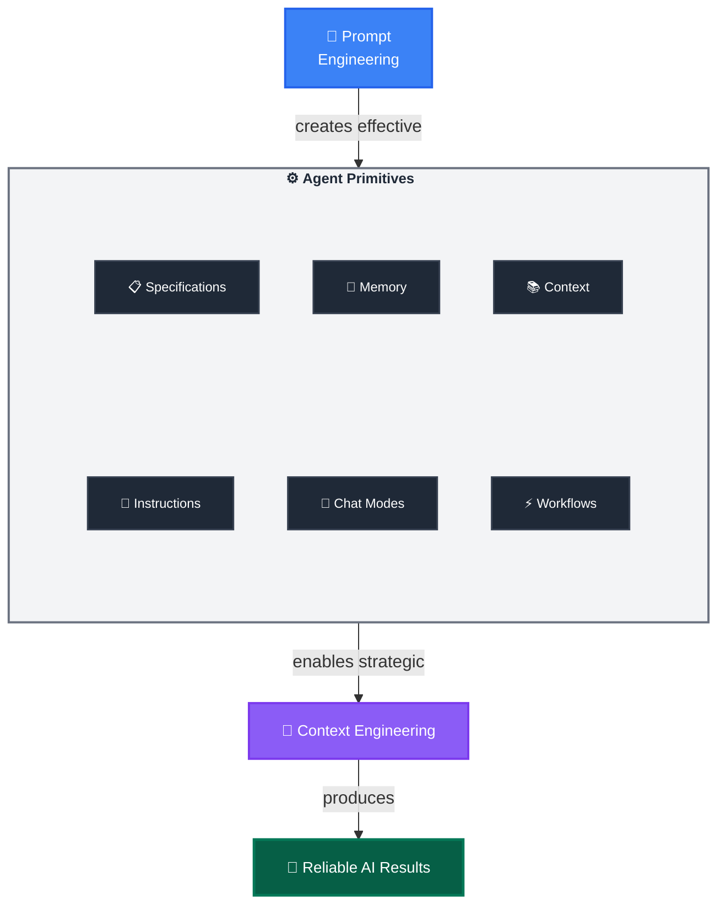

**PROSE turns AI-assisted coding from clever prompts into a repeatable engineering practice: three disciplines, seven primitives, one operating model.**

> 📖 **Deep dive in the handbook:** [Chapter 11 — The Instrumented Codebase →](https://danielmeppiel.github.io/agentic-sdlc-handbook/handbook/ch11-the-instrumented-codebase.html) catalogues the **seven primitive types** (Skills, Agents, Instructions, Prompts, Hooks, Memory, Plans) and the load mechanics behind them. This page is the **operating model** — the short, shareable mental map that every engineer on your team needs before they pick up the primitives.

The [PROSE Specification](https://danielmeppiel.github.io/agentic-sdlc-handbook/handbook/ch12-the-prose-specification.html) defines five architectural constraints for reliable AI-native development. This page shows you how to implement them through three interlocking disciplines: structured prompting, reusable primitives, and strategic context management.

The Three Disciplines are the **operating model**; the seven primitives are the **implementation vocabulary**. Once you internalise the disciplines, the primitives become natural moves — not a taxonomy to memorise.

## How The Practice Implements PROSE

Each discipline implements specific [PROSE constraints](https://danielmeppiel.github.io/agentic-sdlc-handbook/handbook/ch12-the-prose-specification.html#the-five-constraints):

| Discipline | What You Learn | PROSE Constraints | Implemented by primitives |
|------------|----------------|-------------------|---------------------------|
| **Prompt Engineering** | Structured natural language syntax | Enables all constraints | Prompts, Skills |
| **Agent Primitives** | Reusable, composable configuration | Orchestrated Composition, Safety Boundaries | Custom Agents, Skills, Hooks |
| **Context Engineering** | Strategic context window management | Progressive Disclosure, Reduced Scope, Explicit Hierarchy | Instructions, Memory, Plans |

The disciplines build on each other: prompt engineering provides the syntax, primitives make it reusable, and context engineering makes it scale.

## Discipline 1: Prompt Engineering
*Enables all PROSE constraints*

**The Foundation:** Transform natural language into structured, repeatable instructions using Markdown's semantic power.

**Why This Works:** Markdown's structure (headers, lists, links) naturally guides AI reasoning, making outputs more predictable and consistent.

### Key Techniques

- **Context Loading** *(Progressive Disclosure)*: `[Review existing patterns](./src/patterns/)` - Links become context injection points that pull in relevant information, either from files or websites
- **Structured Thinking**: Headers and bullets create clear reasoning pathways for the AI to follow
- **Role Activation**: "You are an expert [role]" - Triggers specialized knowledge domains and focuses responses
- **Tool Integration** *(Safety Boundaries)*: *Use MCP tool `tool-name`* - Connects to deterministic code execution from MCP servers
- **Precision Language**: Eliminate ambiguity through specific, unambiguous instructions
- **Validation Gates** *(Safety Boundaries)*: "Stop and get user approval" - Human oversight at critical decision points

### Quick Win Example

Instead of: `Find and fix the bug`, use:

```markdown
You are an expert debugger, specialized in debugging complex programming issues. 

You are particularly great at debugging this project, which architecture and quirks can be consulted in the [architecture document](./docs/architecture.md). 

Follow these steps:

1. Review the [error logs](./logs/error.log) and identify the root cause. 

2. Use the `azmcp-monitor-log-query` MCP tool to retrieve infrastructure logs from Azure.  

3. Once you find the root cause, think about 3 potential solutions with trade-offs

4. Present your root cause analysis and suggested solutions with trade-offs to the user and seek validation before proceeding with fixes - do not change any files.
```

Once you've mastered structured prompting, you'll quickly realize that manually crafting perfect prompts for every task is unsustainable. This is where the second discipline comes in: turning your prompt engineering insights into reusable, configurable systems.

## Discipline 2: Agent Primitives  
*Implements: Orchestrated Composition · Safety Boundaries*

**The Implementation:** Composable, bounded configuration files that systematically deploy your prompt engineering techniques.

### Core Primitives

- **Instructions Files** *(Orchestrated Composition)*: Deploy structured guidance through modular `.instructions.md` files with targeted scope
- **Custom Agents** *(Safety Boundaries)*: Deploy role-based expertise through `.agent.md` files with MCP tool boundaries that prevent security breaches and cross-domain interference — like professional licenses that keep architects from building and engineers from planning. (Custom Agents replaced the legacy `.chatmode.md` files; see [handbook Ch11 §Agents](https://danielmeppiel.github.io/agentic-sdlc-handbook/handbook/ch11-the-instrumented-codebase.html).)
- **Skills** *(Orchestrated Composition)*: Deploy capability-shaped, auto-activating decision frameworks through `SKILL.md` files. Skills are the new entrypoint primitive — they activate from code patterns and can compose with Custom Agents (see [handbook Ch21](https://danielmeppiel.github.io/agentic-sdlc-handbook/handbook/ch21-the-reference-architecture-earned.html))
- **Agentic Workflows** *(Orchestrated Composition)*: Deploy reusable prompts through `.prompt.md` files with built-in validation
- **Specification Files**: Create implementation-ready blueprints through `.spec.md` files that ensure deterministic outcomes across human and AI executors
- **Agent Memory Files**: Preserve knowledge across sessions through `.memory.md` files
- **Context Helper Files** *(Progressive Disclosure)*: Optimize information retrieval through `.context.md` files

### The Transformation Effect

Agent Primitives are the core configurable elements that AI Native Developers iteratively refine to ensure reliable outcomes through systematic prompt engineering.

- **Example Transformation:**
- **Technique**: "Implement secure user authentication system" (Markdown Prompt Engineering)
- **Primitives**: Developer selects `backend-dev` Custom Agent → Auto-triggers `security.instructions.md` via `applyTo: "auth/**"` → Loads context from `[Previous auth patterns](.memory.md#security)` and `[API Security Standards](api-security.context.md#rest)` → Generates `user-auth.spec.md` using structured templates → Executes `implement-from-spec.prompt.md` workflow with validation gates (Agent Primitives)
- **Outcome**: Developer-driven knowledge accumulation where you capture implementation failures in `.memory.md`, document successful patterns in `.instructions.md`, and refine workflows in `.prompt.md` files—creating compound intelligence that improves through your iterative refinement (Context Engineering)

This transformation might seem complex, but notice the pattern: what started as an ad-hoc request became a systematic workflow with clear handoff points, automatic context loading, and built-in validation. Each primitive file becomes a knowledge asset that improves with use, creating compound intelligence that serves your entire team.

> 💡 **Native VSCode Support**: VSCode natively supports `.instructions.md`, `.prompt.md`, and `.agent.md` (Custom Agents) files. This framework extends the paradigm with `.spec.md`, `.memory.md`, and `.context.md` patterns — frontier concepts in AI Native Development now formalised in the handbook.

With your prompts structured and your primitives set up, you'll encounter a new challenge: even the best prompts and primitives can fail when they're drowning in irrelevant context or competing for limited AI attention. The third discipline addresses this through strategic context management.

## Discipline 3: Context Engineering
*Implements: Progressive Disclosure · Reduced Scope · Explicit Hierarchy*

**The Strategic Framework:** Systematic management of LLM context windows to maximize agent performance within memory constraints.

### Why Context Matters

LLMs have finite attention spans, limited memory (context windows) and are forgetful. Strategic context management not only helps agents focus on relevant information, but enables them to get started quicker by reducing the need to search for and ingest irrelevant or confusing information—thus preserving valuable context window space and improving reliability and effectiveness.

### The Universal Discovery Challenge

The industry developed fragmented context formats—`.instructions.md` (VSCode), `.cursorrules` (Cursor), `.clinerules` (Cline), `CLAUDE.md` (Claude Desktop)—locking teams into single tools. The **[AGENTS.md standard](https://agents.md)** emerged as the universal solution, adopted by 20,000+ open-source projects.

**Example structure:**
```
project/
├── AGENTS.md                    # Root: project-wide principles
├── frontend/
│   ├── AGENTS.md               # Frontend-specific context
│   └── Button.tsx              # Inherits: root + frontend
└── backend/
    ├── AGENTS.md               # Backend-specific context
    └── auth.ts                 # Inherits: root + backend
```

Agents walk up the directory tree and load the closest AGENTS.md file—domain-specific context without global pollution. This hierarchical approach is the foundation of scalable context engineering. 

### Key Techniques

- **Session Splitting** *(Reduced Scope)*: Use distinct Agent sessions for different development phases (planning → implementation → testing). Fresh context = better focus
- **Modular Rule Loading** *(Progressive Disclosure)*: Author `.instructions.md` files with `applyTo` patterns—the precision tool for context loading. Compile to hierarchical `AGENTS.md` for universal portability
- **Hierarchical Discovery** *(Explicit Hierarchy)*: Agents walk directory tree to load closest AGENTS.md—domain-specific context without global pollution. Automatic context optimization reduces context waste.
- **Memory-Driven Development**: Leverage Agent Memory through `.memory.md` files to maintain project knowledge and decisions across sessions
- **Context Optimization** *(Progressive Disclosure)*: Use `.context.md` Context Helper Files to accelerate information retrieval and reduce cognitive load
- **Cognitive Focus Optimization** *(Safety Boundaries)*: Use Custom Agents (`.agent.md` files) to constrain AI attention to relevant domains

### Practical Benefits

- **Session Splitting**: Fresh context window for complex tasks
- **Modular Instructions + Compilation**: Single source of truth (`.instructions.md`) is used to generate portable, optimized context (`AGENTS.md`) automatically.
- **Hierarchical Discovery**: Reduction in context pollution—agents load only relevant instructions for current file
- **Memory-Driven Development**: Preserved project knowledge and decision history across time
- **Context Optimization**: Faster startup time and reduced cognitive overhead
- **Universal Portability**: Same context works across GitHub Copilot, Cursor, Codex, Aider, and all major coding agents

**Implementation Through Primitives:** Each context engineering technique uses Agent Primitives strategically, creating compound benefits for cognitive performance.

## Agentic Workflows: All Disciplines in Action

Now that you understand all three disciplines, you can see how they combine into **Agentic Workflows** - complete, systematic processes that orchestrate all your primitives into end-to-end solutions. These workflows represent the practical application of the entire framework working together.

**Agentic Workflows** are implemented as `.prompt.md` files that coordinate multiple primitives into unified processes, designed to work whether executed locally in your IDE or delegated to async agents.

### Key Characteristics:
- **Full Orchestration**: Combine all three disciplines (Prompt Engineering + Agent Primitives + Context Engineering) into unified processes
- **Complete Automation**: Handle entire development tasks from context loading through implementation to learning integration
- **Execution Flexibility**: Designed to work whether executed locally or delegated to async GitHub Coding Agents
- **Self-Improving Intelligence**: Include learning mechanisms that update primitives based on execution outcomes

**The Power of Integration:** What started as individual techniques and separate primitive files becomes a systematic process that handles complete development tasks while continuously improving through use. Each Agentic Workflow is a `.prompt.md` file that coordinates your entire AI Native Development toolkit into repeatable, reliable processes.

## The AI Native Development Framework

<div class="diagram-container" markdown="1">


```mermaid
flowchart TD
    A["🔧 Prompt<br/>Engineering"] 
    
    subgraph B ["⚙️ Agent Primitives"]
        subgraph B_ROW1 [" "]
            B1["📝 Instructions"]
            B2["💬 Chat Modes"] 
            B3["⚡ Workflows"]
        end
        subgraph B_ROW2 [" "]
            B4["📋 Specifications"]
            B5["🧠 Memory"]
            B6["📚 Context"]
        end
    end
    
    C["🎯 Context Engineering"]
    D["🚀 Reliable AI Results"]
    
    A -->|"creates effective"| B
    B -->|"enables strategic"| C
    C -->|"produces"| D
    
    %% Elegant, accessible color palette with proper contrast
    classDef foundation fill:#3b82f6,stroke:#2563eb,stroke-width:2px,color:#ffffff,font-size:14px
    classDef primitives fill:#1f2937,stroke:#374151,stroke-width:1.5px,color:#ffffff,font-size:12px
    classDef optimization fill:#8b5cf6,stroke:#7c3aed,stroke-width:2px,color:#ffffff,font-size:14px
    classDef outcome fill:#065f46,stroke:#047857,stroke-width:2.5px,color:#ffffff,font-size:14px
    
    class A foundation
    class B1,B2,B3,B4,B5,B6 primitives
    class C optimization
    class D outcome
    
    %% Hide the row subgraph borders
    style B_ROW1 fill:transparent,stroke:none
    style B_ROW2 fill:transparent,stroke:none
    
    %% High contrast container styling for Agent Primitives with spacing
    style B fill:#f3f4f6,stroke:#6b7280,stroke-width:2px,color:#1f2937,font-size:13px,font-weight:bold,margin-top:10px,padding-top:15px
```

</div>

**Prompt Engineering + Agent Primitives + Context Engineering = Reliability**

## Key Takeaways

The three disciplines implement PROSE constraints:

1. **Prompt Engineering** provides the structural syntax that enables all constraints
2. **Agent Primitives** implement Orchestrated Composition and Safety Boundaries through reusable, bounded files  
3. **Context Engineering** implements Progressive Disclosure, Reduced Scope, and Explicit Hierarchy through strategic context management
4. **Agentic Workflows** combine all disciplines into complete, reliable processes

Together, these disciplines create compound intelligence that improves through iterative refinement.

**Ready for hands-on implementation?** Continue to [Getting Started](../getting-started/) to build your first Agent Primitives in Copilot.

**Want to understand the tooling ecosystem?** Jump to [Tooling](../tooling/) for context compilation, package management, and production deployment.

**Ready for advanced orchestration?** Jump to [Agent Delegation](../agent-delegation/) for execution strategies from local control to async delegation.

---

> 📖 **Want the formal specification?** Read [**Chapter 12 — The PROSE Specification →**](https://danielmeppiel.github.io/agentic-sdlc-handbook/handbook/ch12-the-prose-specification.html) in *The Agentic SDLC Handbook* for the rigorous treatment of the five constraints, derivation, anti-patterns, and the maturity model.
