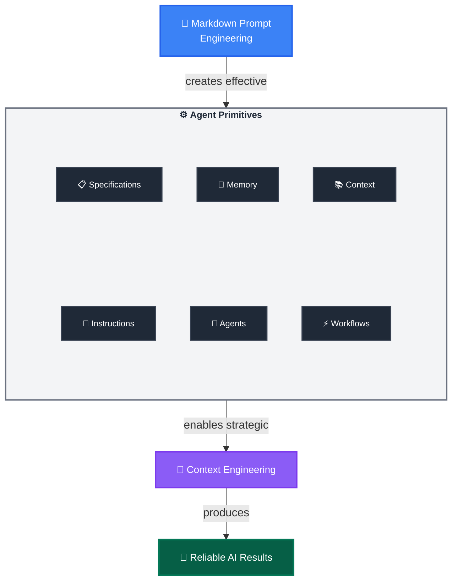

Most developers start with AI by throwing simple prompts at GitHub Copilot and hoping for the best. This approach works for simple tasks but breaks down when you need reliable, repeatable results for complex development work.

**The PROSE Framework** transforms this ad-hoc experimentation into systematic engineering practices:

| | Component | What It Means |
|---|-----------|---------------|
| **P** | **Prompts** | Structured natural language that guides AI behavior |
| **R** | **Reliability** | Deterministic outcomes through context engineering |
| **O** | **Orchestration** | Multi-agent delegation and task decomposition |
| **S** | **Skills** | Capability packages that onboard agents into projects |
| **E** | **Engineering** | A new discipline—systematic AI-native development |

Let's explore each component in depth.

---

## P — Prompts: Markdown Prompt Engineering
**The Foundation:** Transform natural language into structured, repeatable instructions using Markdown's semantic power.

**Why This Works:** Markdown's structure (headers, lists, links) naturally guides AI reasoning, making outputs more predictable and consistent.

### Key Techniques

- **Context Loading**: `[Review existing patterns](./src/patterns/)` - Links become context injection points that pull in relevant information, either from files or websites
- **Structured Thinking**: Headers and bullets create clear reasoning pathways for the AI to follow
- **Role Activation**: "You are an expert [role]" - Triggers specialized knowledge domains and focuses responses
- **Tool Integration**: *Use MCP tool `tool-name`* - Connects to deterministic code execution from MCP servers
- **Precision Language**: Eliminate ambiguity through specific, unambiguous instructions
- **Validation Gates**: "Stop and get user approval" - Human oversight at critical decision points

### Quick Win Example

Instead of: `Find and fix the bug`, use:

```markdown
You are an expert debugger, specialized in debugging complex programming issues. 

You are particularly great at debugging this project, which architecture and quirks can be consulted in the [architecture document](./docs/architecture.md). 

Follow these steps:

1. Review the [error logs](./logs/error.log) and identify the root cause. 

2. Use the `azmcp-monitor-log-query` MCP tool to retrieve infrastructure logs from Azure.  

3. Once you find the root cause, think about 3 potential solutions with trade-offs

4. Present your root cause analysis and suggested solutions with trade-offs to the user and seek validation before proceeding with fixes - do not change any files.
```

Once you've mastered structured prompting, you'll quickly realize that manually crafting perfect prompts for every task is unsustainable. This is where the second layer comes in: turning your prompt engineering insights into reusable, configurable systems.

## S — Skills: Agent Primitives & Skill Packages
**The Implementation:** The configurable building blocks that systematically deploy your prompt engineering techniques—plus **R — Reliability** through built-in validation gates.

### Core Primitives

Primitives are the fundamental files that encode your prompt engineering knowledge into reusable, configurable assets:

- **Instructions Files**: Deploy structured guidance through modular `.instructions.md` files with targeted scope
- **Agents**: Deploy role-based expertise through `.agent.md` files with MCP tool boundaries that prevent security breaches and cross-domain interference—like professional licenses that keep architects from building and engineers from planning
- **Agentic Workflows**: Deploy reusable prompts through `.prompt.md` files with built-in validation
- **Specification Files**: Create implementation-ready blueprints through `.spec.md` files that ensure deterministic outcomes across human and AI executors
- **Agent Memory Files**: Preserve decisions and learnings across sessions through `.memory.md` files
- **Context Helper Files**: Provide reference knowledge for current tasks through `.context.md` files

These primitives can live **locally in your project** for project-specific guidance, or be packaged into **Skills** for sharing and distribution.

### Agent Skills: Packaging for Distribution

Once you've built useful primitives, you'll want to share them across projects or with your team. **[Agent Skills](https://agentskills.io)** are the standardized way to package and distribute capabilities.

Think of it like npm packages and JavaScript modules: **Skills are the packages you distribute; primitives are common components but Skills can contain anything.**

```
┌─────────────────────────────────────────────────────────────────┐
│  SKILL (Distribution Layer)                                     │
│  ├── SKILL.md              → Discovery & auto-summoning trigger │
│  ├── Primitives (common):                                       │
│  │   ├── .instructions.md  → Guidance and guardrails            │
│  │   ├── .prompt.md        → Reusable workflows                 │
│  │   └── .agent.md         → Role-based personas                │
│  └── Any Resources:                                             │
│      ├── scripts/          → Python, shell, Node.js scripts     │
│      ├── templates/        → Code templates, boilerplate        │
│      ├── data/             → JSON schemas, config files         │
│      ├── images/           → Diagrams, reference visuals        │
│      └── examples/         → Working code samples               │
└─────────────────────────────────────────────────────────────────┘
```

**Skills are packaged agent capabilities.** While primitives like `.instructions.md` and `.prompt.md` are common, Skills can include anything an agent might need: Python scripts for automation, images for visual reference, data files for schemas, or executable tools. The only requirement is a `SKILL.md` that tells agents when and how to use the Skill.

**Key properties of Skills:**

- **SKILL.md**: The discovery file that enables **progressive context disclosure**—agents scan available Skills and auto-summon only what's relevant to the current task
- **Auto-Discovery**: No explicit `/command` needed—agents load Skills based on task relevance
- **Composable**: Skills can depend on other Skills, creating layered capability stacks
- **Portable**: Same SKILL.md works across Claude, Copilot, Cursor, and all major coding agents

### The Transformation Effect

Agent Primitives are the core configurable elements that AI Native Developers iteratively refine to ensure reliable outcomes through systematic prompt engineering.

**Example Transformation:**
- **Technique**: "Implement secure user authentication system" (Markdown Prompt Engineering)
- **Primitives**: Developer selects `backend-dev` chat mode → Auto-triggers `security.instructions.md` via `applyTo: "auth/**"` → Loads context from `[Previous auth patterns](.memory.md#security)` and `[API Security Standards](api-security.context.md#rest)` → Generates `user-auth.spec.md` using structured templates → Executes `implement-from-spec.prompt.md` workflow with validation gates (Agent Primitives)
- **Outcome**: Developer-driven knowledge accumulation where you capture implementation failures in `.memory.md`, document successful patterns in `.instructions.md`, and refine workflows in `.prompt.md` files—creating compound intelligence that improves through your iterative refinement (Context Engineering)

This transformation might seem complex, but notice the pattern: what started as an ad-hoc request became a systematic workflow with clear handoff points, automatic context loading, and built-in validation. Each primitive file becomes a knowledge asset that improves with use, creating compound intelligence that serves your entire team.

> 💡 **Native VSCode Support**: While VSCode natively supports `.instructions.md`, `.prompt.md`, and `.agent.md` files, this framework extends the paradigm with `.spec.md`, `.memory.md`, and `.context.md` patterns that represent frontier concepts in AI Native Development.

With your prompts structured and your primitives set up, you'll encounter a new challenge: even the best prompts and primitives can fail when they're drowning in irrelevant context or competing for limited AI attention. The third layer addresses this through strategic context management.

## E — Engineering: Context Management
**The Strategic Framework:** Systematic management of LLM context windows to maximize agent performance within memory constraints.

### Why Context Matters

LLMs have finite attention spans, limited memory (context windows) and are forgetful. Strategic context management helps agents focus on relevant information and get started quicker—preserving valuable context window space and improving reliability.

### Collaborative Context Loading

Context loading is a **collaborative effort** between you and the agent:

```
Developer provides:           Agent contributes:
├── Local primitives          ├── Auto-summoned Skills
├── Project AGENTS.md         ├── Task-relevant tool selection
└── User prompt               └── System prompt
```

When Skills are installed, their SKILL.md descriptions are visible to the agent. During any interaction—including `.prompt.md` workflow execution—the agent evaluates whether available Skills are relevant to the current task. When a match is found, the agent automatically summons that Skill's capabilities. This means your workflows can gain capabilities dynamically, even ones you didn't explicitly invoke.

### The Universal Discovery Challenge

The industry developed fragmented context formats—`.instructions.md` (VSCode), `.cursorrules` (Cursor), `.clinerules` (Cline), `CLAUDE.md` (Claude Desktop)—locking teams into single tools. The **[AGENTS.md standard](https://agents.md)** emerged as the universal solution, adopted by 20,000+ open-source projects.

**Example structure:**
```
project/
├── AGENTS.md                    # Root: project-wide principles
├── frontend/
│   ├── AGENTS.md               # Frontend-specific context
│   └── Button.tsx              # Inherits: root + frontend
└── backend/
    ├── AGENTS.md               # Backend-specific context
    └── auth.ts                 # Inherits: root + backend
```

Agents walk up the directory tree and load the closest AGENTS.md file—domain-specific context without global pollution. This hierarchical approach is the foundation of scalable context engineering. 

### Key Techniques

- **Progressive Context Disclosure**: Structure prompts to reveal information incrementally rather than all at once—use markdown hyperlinks like `[detailed requirements](./specs/auth.md)` so agents fetch context only when needed. Skills extend this pattern by enabling auto-discovery of relevant capabilities based on task context, since only the Skill descriptions are initially loaded into the context window.
- **Session Splitting**: Use distinct Agent sessions for different development phases (planning → implementation → testing). Fresh context = better focus
- **Modular Rule Loading**: Author `.instructions.md` files with `applyTo` patterns—the precision tool for context loading. Compile to hierarchical `AGENTS.md` for universal portability
- **Hierarchical Discovery**: Agents walk directory tree to load closest AGENTS.md—domain-specific context without global pollution. Automatic context optimization reduces context waste
- **Skills Composition**: Install Skills that depend on other Skills—transitive dependency resolution ensures complete capability stacks without manual orchestration
- **Memory-Driven Development**: Leverage Agent Memory through `.memory.md` files to maintain project knowledge and decisions across sessions
- **Context Optimization**: Use `.context.md` Context Helper Files to accelerate information retrieval and reduce cognitive load
- **Cognitive Focus Optimization**: Use custom agents in `.agent.md` files to constrain AI attention to relevant domains

### Practical Benefits

- **Progressive Context Disclosure**: Agents summon Skills automatically based on task relevance—zero manual configuration per interaction
- **Session Splitting**: Fresh context window for complex tasks
- **Modular Instructions + Compilation**: Single source of truth (`.instructions.md`) generates portable, optimized context (`AGENTS.md`) automatically
- **Hierarchical Discovery**: Reduction in context pollution—agents load only relevant instructions for current file
- **Skills Composition**: Install once, benefit everywhere—transitive dependencies bring in complete capability stacks
- **Memory-Driven Development**: Preserved project knowledge and decision history across time
- **Context Optimization**: Faster startup time and reduced cognitive overhead
- **Universal Portability**: Same context works across GitHub Copilot, Cursor, Codex, Aider, Claude, and all major coding agents

**Implementation Through Primitives:** Each context engineering technique uses Agent Primitives strategically, creating compound benefits for cognitive performance.

## O — Orchestration: Agentic Workflows

Now that you understand **P**rompts, **S**kills, and **E**ngineering, you can see how they combine into **Agentic Workflows** - complete, systematic processes that orchestrate all your primitives into end-to-end solutions. These workflows represent the practical application of the entire PROSE Framework working together.

**Agentic Workflows** are implemented as `.prompt.md` files that coordinate multiple primitives into unified processes, designed to work whether executed locally in your IDE or delegated to async agents.

### Key Characteristics:
- **Full Orchestration**: Combine all PROSE components (Prompts + Skills + Engineering + Reliability) into unified processes
- **Complete Automation**: Handle entire development tasks from context loading through implementation to learning integration
- **Execution Flexibility**: Designed to work whether executed locally or delegated to async GitHub Coding Agents
- **Self-Improving Intelligence**: Include learning mechanisms that update primitives based on execution outcomes

**The Power of Integration:** What started as individual techniques and separate primitive files becomes a systematic process that handles complete development tasks while continuously improving through use. Each Agentic Workflow is a `.prompt.md` file that coordinates your entire PROSE toolkit into repeatable, reliable processes.

## The PROSE Framework

<div class="diagram-container" markdown="1">


```mermaid
flowchart TD
    A["🔧 Markdown Prompt<br/>Engineering"] 
    
    subgraph B ["⚙️ Agent Primitives"]
        subgraph B_ROW1 [" "]
            B1["📝 Instructions"]
            B2["💬 Agents"] 
            B3["⚡ Workflows"]
        end
        subgraph B_ROW2 [" "]
            B4["📋 Specifications"]
            B5["🧠 Memory"]
            B6["📚 Context"]
        end
    end
    
    C["🎯 Context Engineering"]
    D["🚀 Reliable AI Results"]
    
    A -->|"creates effective"| B
    B -->|"enables strategic"| C
    C -->|"produces"| D
    
    %% Elegant, accessible color palette with proper contrast
    classDef foundation fill:#3b82f6,stroke:#2563eb,stroke-width:2px,color:#ffffff,font-size:14px
    classDef primitives fill:#1f2937,stroke:#374151,stroke-width:1.5px,color:#ffffff,font-size:12px
    classDef optimization fill:#8b5cf6,stroke:#7c3aed,stroke-width:2px,color:#ffffff,font-size:14px
    classDef outcome fill:#065f46,stroke:#047857,stroke-width:2.5px,color:#ffffff,font-size:14px
    
    class A foundation
    class B1,B2,B3,B4,B5,B6 primitives
    class C optimization
    class D outcome
    
    %% Hide the row subgraph borders
    style B_ROW1 fill:transparent,stroke:none
    style B_ROW2 fill:transparent,stroke:none
    
    %% High contrast container styling for Agent Primitives with spacing
    style B fill:#f3f4f6,stroke:#6b7280,stroke-width:2px,color:#1f2937,font-size:13px,font-weight:bold,margin-top:10px,padding-top:15px
```

</div>

**P**rompts + **S**kills + **E**ngineering → **O**rchestration → **R**eliability

## Key Takeaways

1. **P — Prompts**: Markdown Prompt Engineering provides the structural foundation for predictable AI interactions
2. **S — Skills**: Agent Primitives encode prompt engineering into reusable files; Skills package them for distribution with auto-discovery
3. **E — Engineering**: Context management is collaborative—you provide primitives and Skills, agents contribute dynamic capability discovery
4. **O — Orchestration**: Agentic Workflows coordinate all components into complete, self-improving processes
5. **R — Reliability**: Validation gates, deterministic specifications, and systematic approaches deliver consistent outcomes

**Ready for hands-on implementation?** Continue to [Getting Started](../getting-started/) to build your first Agent Primitives and culminate with your first Agentic Workflow.

**Want to understand the tooling ecosystem?** Jump to [Tooling](../tooling/) to learn about Agent CLI Runtimes, context compilation, and agent package management.

**Want to see complete workflow execution strategies?** Jump to [Agent Delegation](../agent-delegation/) for local and async orchestration patterns.
