Transform natural language chaos into systematic, repeatable AI workflows through three foundational engineering layers.

---

## Layer 1: Markdown Prompt Engineering
**The Foundation:** Transform natural language into structured, repeatable instructions using Markdown's semantic power.

**Why This Works:** Markdown's structure (headers, lists, links) naturally guides AI reasoning, making outputs more predictable and consistent.

### Key Techniques

- **Context Loading**: `[Review existing patterns](./src/patterns/)` - Links become context injection points that pull in relevant information, either from files or websites
- **Structured Thinking**: Headers and bullets create clear reasoning pathways for the AI to follow
- **Role Activation**: "You are an expert [role]" - Triggers specialized knowledge domains and focuses responses
- **Tool Integration**: *Use MCP tool `tool-name`* - Connects to deterministic code execution from MCP servers
- **Precision Language**: Eliminate ambiguity through specific, unambiguous instructions
- **Validation Gates**: "Stop and get user approval" - Human oversight at critical decision points

### Quick Win Example

Instead of: `Find and fix the bug`, use:

```markdown
You are an expert debugger, specialized in debugging complex programming issues. 

You are particularly great at debugging this project, which architecture and quirks can be consulted in the [architecture document](./docs/architecture.md). 

Follow these steps:

1. Review the [error logs](./logs/error.log) and identify the root cause. 

2. Use the `azmcp-monitor-log-query` MCP tool to retrieve infrastructure logs from Azure.  

3. Once you find the root cause, think about 3 potential solutions with trade-offs

4. Present your root cause analysis and suggested solutions with trade-offs to the user and seek validation before proceeding with fixes - do not change any files.
```

---

## Layer 2: Agent Primitives  
**The Implementation:** The configurable tools that systematically deploy your prompt engineering techniques.

### Core Primitives

- **Instructions Files**: Deploy structured guidance through modular `.instructions.md` files with targeted scope
- **Chat Modes**: Deploy role-based expertise through `.chatmode.md` files with MCP tool boundaries that prevent security breaches and cross-domain interference - like professional licenses that keep architects from building and engineers from planning
- **Prompt Workflows**: Deploy reusable task templates through `.prompt.md` files with built-in validation
- **Specification Files**: Create implementation-ready blueprints through `.spec.md` files that ensure deterministic outcomes across human and AI executors
- **Agent Memory Files**: Preserve knowledge across sessions through `.memory.md` files
- **Context Helper Files**: Optimize information retrieval through `.context.md` files

### The Transformation Effect

Agent Primitives are the core configurable elements that AI Native Developers iteratively refine to ensure reliable outcomes through systematic prompt engineering.

**Example Transformation:**
- **Technique**: "Implement secure user authentication system" (Markdown Prompt Engineering)
- **Primitives**: Developer selects `backend-dev` chat mode → Auto-triggers `security.instructions.md` via `applyTo: "auth/**"` → Loads context from `[Previous auth patterns](.memory.md#security)` and `[API Security Standards](api-security.context.md#rest)` → Generates `user-auth.spec.md` using structured templates → Executes `implement-from-spec.prompt.md` workflow with validation gates (Agent Primitives)
- **Outcome**: Developer-driven knowledge accumulation where you capture implementation failures in `.memory.md`, document successful patterns in `.instructions.md`, and refine workflows in `.prompt.md` files—creating compound intelligence that improves through your iterative refinement (Context Engineering)

> 💡 **Native VSCode Support**: While VSCode natively supports `.instructions.md`, `.prompt.md`, and `.chatmode.md` files, this framework extends the paradigm with `.spec.md`, `.memory.md`, and `.context.md` patterns that represent frontier concepts in AI Native Development.

---

## Layer 3: Context Engineering
**The Strategic Framework:** Systematic management of LLM context windows to maximize agent performance within memory constraints.

### Why Context Matters

LLMs have finite attention spans, limited memory (context windows) and are forgetful. Strategic context management not only helps agents focus on relevant information, but enables them to get started quicker by reducing the need to search for and ingest irrelevant or confusing information—thus preserving valuable context window space and improving reliability and effectiveness.

### Key Techniques

- **Session Splitting**: Use distinct Agent sessions for different development phases (planning → implementation → testing). Fresh context = better focus
- **Modular Rule Loading**: Apply only relevant instructions through targeted `.instructions.md` files using `applyTo` yaml frontmatter syntax, preserving context space for actual work
- **Memory-Driven Development**: Leverage Agent Memory through `.memory.md` files to maintain project knowledge and decisions across sessions and time
- **Context Optimization**: Use `.context.md` Context Helper Files strategically to accelerate information retrieval and reduce cognitive load
- **Cognitive Focus Optimization**: Use chat modes in `.chatmode.md` files to constrain AI attention to relevant domains, preventing cross-domain interference

### Practical Benefits

- **Session Splitting**: Fresh context window for complex tasks
- **Modular Rules**: Reduced irrelevant suggestions through targeted instructions
- **Memory-Driven Development**: Preserved project knowledge and decision history across time
- **Context Optimization**: Faster startup time and reduced cognitive overhead through pre-curated information
- **Reliability Boost**: Less context pollution leads to more consistent and accurate outputs

**Implementation Through Primitives:** Each context engineering technique uses Agent Primitives strategically, creating compound benefits for cognitive performance.

---

## The AI Native Development Framework

```mermaid
flowchart TD
    A["🔧 Markdown Prompt<br/>Engineering"] 
    
    subgraph B ["⚙️ Agent Primitives"]
        subgraph B_ROW1 [" "]
            B1["📝 Instructions"]
            B2["💬 Chat Modes"] 
            B3["⚡ Workflows"]
        end
        subgraph B_ROW2 [" "]
            B4["📋 Specifications"]
            B5["🧠 Memory"]
            B6["📚 Context"]
        end
    end
    
    C["🎯 Context Engineering"]
    D["🚀 Reliable AI Results"]
    
    A -->|"creates effective"| B
    B -->|"enables strategic"| C
    C -->|"produces"| D
    
    %% Elegant, accessible color palette with proper contrast
    classDef foundation fill:#3b82f6,stroke:#2563eb,stroke-width:2px,color:#ffffff,font-size:14px
    classDef primitives fill:#1f2937,stroke:#374151,stroke-width:1.5px,color:#ffffff,font-size:12px
    classDef optimization fill:#8b5cf6,stroke:#7c3aed,stroke-width:2px,color:#ffffff,font-size:14px
    classDef outcome fill:#065f46,stroke:#047857,stroke-width:2.5px,color:#ffffff,font-size:14px
    
    class A foundation
    class B1,B2,B3,B4,B5,B6 primitives
    class C optimization
    class D outcome
    
    %% Hide the row subgraph borders
    style B_ROW1 fill:transparent,stroke:none
    style B_ROW2 fill:transparent,stroke:none
    
    %% High contrast container styling for Agent Primitives with spacing
    style B fill:#f3f4f6,stroke:#6b7280,stroke-width:2px,color:#1f2937,font-size:13px,font-weight:bold,margin-top:10px,padding-top:15px
```

<div class="diagram-container" markdown="1">



</div>

**The Formula: Markdown Prompt Engineering + Agent Primitives = Context Engineering**

---

## 🎯 Key Takeaways

1. **Markdown Prompt Engineering** provides the structural foundation for predictable AI interactions
2. **Agent Primitives** are your configurable tools that scale and systematize these techniques
3. **Context Engineering** optimizes AI cognitive performance within memory constraints
4. **The Framework** creates compound intelligence that improves through iterative refinement

**Ready for hands-on implementation?** Continue to [Getting Started](../getting-started/) to build your first Agent Primitives.

**Want to see the complete workflow in action?** Jump to [Workflow Orchestration](../workflows/) for end-to-end examples.
